# Hopes and Dreams

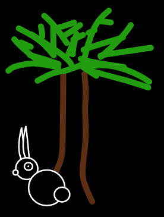

Hopes and Dreams is a social platform designed to help users collaborate, share and plan their hopes, aspirations, dreams and goals.  The site is designed as a collaborative space through which, with a little luck and a little help, those dreams might come true.

## Contents:

### UX Design

[UX Design - Strategy](#ux---strategy)\
[UX Design - Scope](#ux---scope)\
[UX Design - Structure](#ux---structure)\
[UX Design - Skeleton](#ux---skeleton)\
[UX Design - Surface](#ux---surface)

### The MVP

[Specification Changes](#specification-changes)\
[MVP Data Structure](#mvp-data-structure)\
[Feature List](#feature-list)

### Testing and Deployment

[Testing Documentation](#testing-documentation)\
[Deployment](#deployment)

### Credits and Technical

[Credits](#credits)\
[Technical Information](#technical-information)

## UX - Strategy 
([back to top](#contents))

### 1) Research

My research ahead of this project has involved looking at existing social platforms and analyzing what makes them work (or otherwise) and interviewing friends, colleagues and family to understand what they do and don't like about them.  I am also lucky to be able to draw on 20 years of experience working in online advertising and marketing.  On reviewing the information I have been able to gather, I have settled on a number of key points which, through the establishment of developer goals and user stories, will be important in a social platform as intimate as this.

### 2) Project Goal

Hopes and Dreams intends to be a place to realise positive aspirations. In spite of this, I intend to avoid the sort of language that exists around setting goals.  Whilst planning tools can be part of the process (either as part of the MVP or part of the evolution of the project) this platform is about encouraging blue skies thinking. The intention is that a community will develop to support people in pursuit of their dreams, at which point they might even become goals, rather than interaction with the site be a goal-setting exercise in itself.  The aspiration is almost as important as the realisation, as such creating and sharing a dream with the community will be intended as a journey of discovery rather than a chore.  Dreams are meant to be shared and celebrated almost as much as they are meant to be realised.

The main goal of the project then, is to develop this community and bring people together, through a UI which makes the site a pleasure to use.  It's about having people put their dreams and ideas in writing and find like-minded people.  On a simple MVP level this will simply be about matching dreams to users, creating a 'feed of dreams' containing a variety of fascinating hopes and aspirations, hopefully some of which will motivate the user to positively engage - whether this engagement means offering advice, the benefit of experience or even practical assistance.  The site will also act as a more conventional social platform, where you can actively search for and follow individuals or their aspirations and receive updates about how things are going for them.

### 3) Developer Goals

- Build portfolio: I want this project to display originality which will make it stand out from the crowd and provide value for users.
- Develop technical skills:  I would like to make use of JQuery on this occasion to simplify the Javascript, along with more advanced CSS techniques to create a feast for the eyes.  The way the database is indexed will be very important and I think I will learn a lot duriung this project, probably the hard way!
- Extensibility: Using Mongo DB as a DBMS combined with a modular plan for the design means there is huge scope for future development and monetisation.

### 4) Site Owner - User Stories

Based on my project research I have identified the following key areas.

- Brand Identity: The branding needs to be strong and clear from page one
- Site purpose:  The site mission and purpose needs to be clearly stated to encourage sign-up.  It needs to inspire people.
- Simple sign-up: I want as much site interaction as possible as quickly as possible and users need a simple sign-up process just as soon as they hit the homepage.
- Clean UI: I want the UI to be a stripped down and simple as possible so that it functions as well on mobile as it does on desktop, and looks great on both.  I want it to look so great people can't wait to click or tap on things.
- Clear User Journey:  From the minute the user clicks the sign-up button, they need to be hand-held through the process.  This is a new concept and signing up is the most important part of that journey.  As soon as they have signed up and land in the site for the first time, the question 'what do I do now' needs to be answered.
- Organic feed:  No edge weighting, all content has an equal chance on the general feed. No compulsary marketing on any feed. Logic for displaying dreams must be clean and effective.

### 5) Site Visitor - User Stories

This site should be for everyone, from any walk of life.  As such the user stories focus on UI, engagement and provision of compelling content.

- Reasons to stay:  The homepage needs to give users instant motivation to sign up, through brand imagery and a clear concept.
- Clean user journey:  The user journey needs to be interesting, but not too long, particularly through the sign-up phase.
- Quick and intuitive UI: to avoid drop-outs the user should not be hunting for anything.
- Customisable look and feel: People like to be able to make their corner of the web their own.  
- Access to content: Feeds need to reflect what people are following and the things they have interest in, and searches need to deliver relevant results.
- Safe Space:  Users need to feel their data is safe, that any data they provide is provided for a good reason, and that they have control over comments and content they see.

## UX - Scope
([back to top](#contents))

It is important to make clear at that the below is the scope envisaged at the beginning of the project, and that there was always anticipated to be an evolutionary process in producing an MVP.  For a full overview of specification changes in the finished MVP, please click [HERE](#specification-changes).

### Technology

The technology used will be HTML/CSS and JavaScript/JQuery, using Python with the Flask framework as a templating language and MongoDB to store data.

I have chosen to use MongoDB over PostgreSQL for a number of reasons (in order of importance):
 - Type of Application:  From the reading I've done it seems MongoDB is a great option for unstructured data the likes of which you find on social media platforms, and is being widely adopted by 'big-tech' companies.
 - Development Cycle: The lack of requirement for a rigid schema will suit the ongoing development of this project, with its potential for expansion and growth (both to MVP level and beyond).  I feel like the application could see significant evolution as I develop it and encounter new challenges.
 - Data storage capacity:  ElephantSQL only provides 25MB storage with the base package, which is extremely low headroom for this sort of application, whilst MongoDB Atlas provides 512MB which should be more than enough.
 - MongoDB Atlas:  Atlas is a slick platform with a superb UI and great documentation, making it a pleasure to use. 
 - Personal Development:  Because my fourth project will involve using the Django framework with a relational database and being familiar with MySQL from the past, I feel like using MongoDB here will add a very useful string to my bow and further my professional development.
 - Obselescence: This relates to course material, where the PostgreSQL module is far lower in quality than the MongoDB content.  Whilst both contain deprecated code, only minor changes were required to update PyMongo functionality to be compatible with latest package versions and therefore make the code viable for use in a brand-new real-world application. The SQLAlchemy methodology I have been taught caused all sorts of problems and required very specific package versions to function whilst leaving out key concepts such as search functionality and user authentication; it would need a lot of additional learning to fill these gaps in my knowledge which I don't have time for in the context of this course.

### Core Elements (MVP)

#### Structure

 - Landing Page: features logo, brief site description and sign up / sign in option.  All about branding the site.
 - New User Journey:  On clicking Sign Up will begin a user journey.
 - Base Elements:  Once signed in each page will have title/logo and menu with four core elements, plus a search.
 - Feed (default page): The main site feed is divided into two elements, Dreamscape (default) and Personal
 - Profile: Consists of an overview of your profile and options to update info divided into 2 sections, account or personal settings.
 - Dreams: This page will list the user's current Hopes and Dreams. 
 - Dreambuilder:  This is a walkthrough process for creating a new dream. 
 - Update Dream Page:  Page will consist of a description, and underneath icons representing each aspect of a dream.  Where an available module doesn't exist there will be the option to create it.
 - View dream page: here the user can review your dream as others see it, and view, rate and respond to any offers of help, comments or encouragement that other users have provided.

#### Features

NB This MVP feature list represents this site as I currently envisage it, and will be subject to change (probably quite a lot of it!)

 - Detailed step-by-step user journey planner to introduce them to the world of hopes and dreams, which not only gets them signed up to the site but introduces the site concept in small bites.  Unfolds in stages over multiple pages with strong brand imagery based around default theme.  A bare minimum of the personal profile settings will be set compulsararily here for initial discovery (to avoid an empty feed after signup!).
 - Multiple feeds - one just to follow and/or assist with dreams and one to follow people and dreams you know or are interested in.
 - Dreamscape feed is a 'feed of dreams' consisting of dreams from other users that appear based on the user's interests/skills and also personal settings.  The user can choose to comment, offer advice or offer a service (based on dream requirements).  Alternatively users can just enjoy reading other peoples hopes and dreams.
 - Personal feed will consist of actions from people or dreams you follow, reactions to your comments, comments on your own dreams or any other modules (beyond the MVP)
 - Step-by-step Dreambuilder wizard to walk the user through the process of building their dream. Only a name, description and keywords are compulsary fields, the rest can be added later, or not added at all.  The intention is dreams should be quite freeform.
 - Optional modular elements for your dream, the core of which will be the dream diary, dream requirements and a dream planner
 - Each dream will be listed with a brief description if any exist, and the option to view the dream, update it, or undream it.  If you have no dreams a tutorial message will appear below the Dreambuilder inviting you to share your hopes and dreams.
 - Opportunities to update skills and interests to ensure the user only sees what they are intererested in. Account and personal settings which allow the user to customize their experience.Account settings will include Name, Profile Pic, e-mail address, Location (optional), notifications/privacy settings (if included). Personal settings inlcude Skills/Experiences/Interests, projects, open to (which may be rolled into the privacy settings)
 - Users may comment on a dream to offer advice or encouragement, or offer specific help or services.  They may also follow a specific dream in their personal feed.
 - Users may rate comments, and have the option to filter users with very low scores (which indicates spam, trolling or other destructive behaviour)
 - Search facility to find friends or chase specific dreams.
 - 3 user levels, admin, moderator or user.  The single admin (ie me) will be able to create other moderators and both will be able to remove users and content deemded to be in breach of the Terms of Use Policy.
 - Basic themes - dreams and indeed profiles can be tailored with basic color themes.
 - Image handling - all user supplied images converted and compressed appropriately to the platform. I will also need to work out somewhere to put them when using a Heroku deployment.

### Optional Features

 - Additional Services module for dreams. Will allow companies to offer their services (eg if your dream is to be a web developer, you might be offered courses). Would allow for targeted, entirely optional monetisation without weakening the platform.
 - Organisations module for dreams. If added would provide details of organisations that may be able to help via an API. 
 - Extended notification and privacy settings for each feed, in order to make them highly customisable.
 - The ability to have an advanced range of search options and more advanced requirement gathering, allowing dreams to feature according to multple categories. This is highly unlikely to feature in the MVP; although there may well be multple categories for users/dreams it is likely they will be grouped together when indexing each side of the search for discovery purposes.
 - Advanced/custom themes: The ability to select from multiple advanced themes when setting up dreams and accounts, including images.  The ability to create custom themes.  Whilst I view this as a lot more important than just a nice to have given the feedback from some of my research, I'm not sure I'll have time to include it in the MVP for this project as well as providing the basic functionality it needs to be a working real-world application.
 - Suggest people to follow by connecting with other social apps via API.  Could also use to invite new users to the service.  Useful growth tool.
 - Infinite scrolling on feeds.

 ### Hopes and Dreams

 - Hopes and Dreams mobile app, with full site integration.
 - Integration with other social APIs to enable users to add friends and share content.

## UX - Structure
([back to top](#contents))

As with the Scope, it is important to make clear at that the below is the scope envisaged at the beginning of the project, and that there was always anticipated to be an evolutionary process in producing an MVP.  For a full overview of specification changes in the finished MVP, please click [HERE](#specification-changes).

The data structure for the submitted MPV can be found [HERE](#mvp-data-structure).

### Site pages and elements

#### Header and Site Navigation

The homepage navigation will simply be a sign up/sign in button prominently placed, which leads either to the sign-up user journey or the Dreamscape feed by default on signing in.

Once logged in the main navigation will be in the form of bold icons indicating the function of each page, and a logo will appear either alongside or above the navigation.
 - Feeds
 - Profile
 - Dreams

Furthermore search functionality will also be included on all pages.  This will take either the form of a search bar with a radial offering the option to search for people or dreams, or an additional icon which would open a more detailed search page.  The choice of concept here will likely evolve along with the site design.

My philosophy is to simplify navigation and avoid the need for additional pop-up/drop-down menus on mobile which impair site feel and are largely un-necessary if navigation is well designed.

#### Footer

If I view any social site there is no main footer as such, and indeed Facebook does not include one either - this seems to be for two reasons; one is infinite scroll, the other is space being limited on a mobile screen.  Any important information (copyright, terms of service) can be located elsewhere; with this in mind I'm not sure what a footer would add so I won't be including one. 

#### Sign-up user journey

This will consist of a series of pages requesting use information to complete the sign-up process.  The intention is not only to gather the information required for the site to be functional, but to introduce the user to key site concepts, build anticipation about site content and encourage exploration once signed up.

#### Feed pages

The feed pages will consist of a scrollable list of items in the feed, along with options to interact at the bottom of each item.  This will include like buttons, and the ability to follow, unfollow, expand the comments section or leave a new comment.  Where dreams are concerned users will also be able to access full details about the dream and the user who created it from the feed.

The feed will take two forms - one is a personal feed which will show the latest from all the content and people the user is following.  the other is the Dreamscape feed where the user can browse the dreams that others have created.

#### Dreams page

The dreams page will list Dreams and descriptions of them, with latest comments.  You can also expand them to view various modules and comments therein, or open them in the Dream Editor page.  At the top of the page will also be the Dream Builder button which initiates the user journey for building a dream.

#### Dream Editor

Large icons will represent the various dream modules if present, otherwise there is an icon to create them.  Here you can also enter various modules to edit and update them

#### Dream Builder

The Dream Builder icon initiates the user journey to create a dream, walking the user through each stage of the process.  Not all modules are compulsary but each dream will require a name, description and some category tags so people can discover it.

#### Profile Page

The user will be faced with two options - it defaults to personal which allows them to update skills, interests, projects and experience to tailor what they see in their Dreamscape feed.  The user can also access Account Settings from this page to update their personal info and privacy/notification settings.

### Core Data Structure

Please note that this section represents the initial design phase for the database schema, and as I outlined below it was always going to be subject to change. The data structure for the completed MVP can be found [HERE](#mvp-data-structure).

Using Mongo DB and a modular approach to building key elements of the site means I have opted for an extremely flat structure, creating new collections where possible to make data easily accessible and speeding up the process of removing data.  This data structure has been put together with two major provisos - one is that this is my first MongoDB project and I do not yet know how this structure will evolve in practice.  It may well be that I need to merge, nest or separate various collections as the requirements of the platform become clearer.  My preference at this stage is to keep it as simple as possible!

#### Users Collection

This will include basic user data, key settings for discovery of dreams and notification/privacy settings.

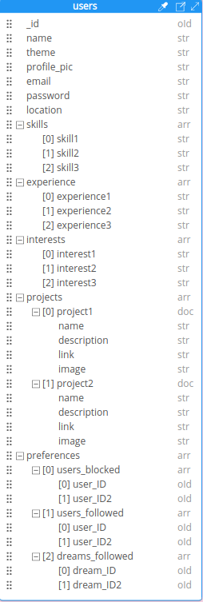

#### Dream Collection

This is the collection for base dream data.  It includes all the data to be included in feeds and discovery, and is linked to a user by the user's ID.  Comments will be enabled on dreams.

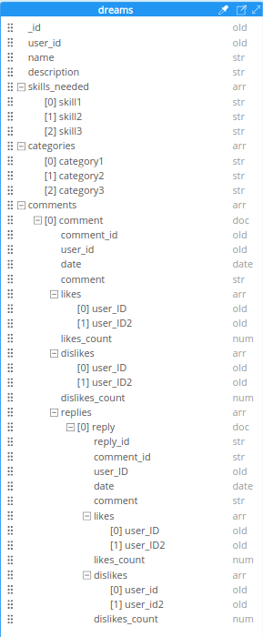

### Modular Components Data Structure

The below represent modular components of dreams. The key concept among these components is the Diary Module, which will form part of the MVP - the rest may not all be included in the MVP depending on timescales and viability, however it is intended that they should be.

#### Diary Collection

The diary is a modular component of a dream, and is linked to a dream by the dream's ID. Comments will be enabled for diary entries.

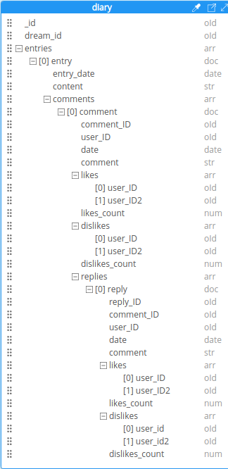

#### Goals Collection

Goals are a modular component of a dream, and are linked to a dream by the dream ID. Comments will be enabled for goals.

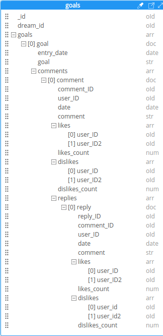

#### Planner Collection

The Planner collection will be created on the same basis as other dream modules and will have comments enabled.  Each plan within the planner will have an associated task, which can include any number of steps.

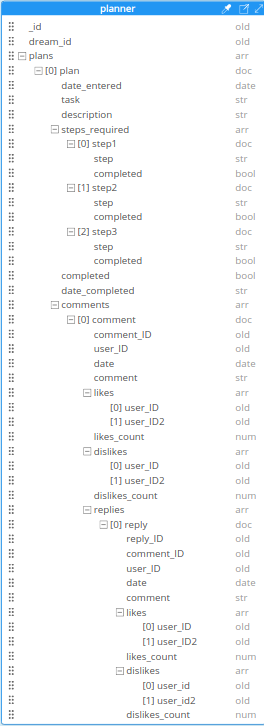

#### Requests Collection

The requests module of a dream allows a user to request any number of specific skills or assistance within the skills required section. This can then be associated with users offering their services.

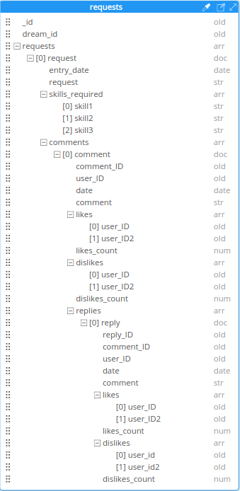

## UX - Skeleton
([back to top](#contents))

As with the Scope and Structure, it is important to make clear at that the below is the Skeleton envisaged at the beginning of the project, and that there was always anticipated to be an evolutionary process in producing an MVP.  This said the guiding principles set out here for the design of the platform have been adhered to throughout, if not the specifics.  For a full overview of specification changes in the finished MVP, please click [HERE](#specification-changes).

### Design Choices

 - Landing page aside, I have kept the menu system consistently placed throughout the site according to the platform on which it is being viewed.
 - Menu icons will be consistently placed, and where possible will include a description of what the icon does for clarity, in consideration of older or less 'web-savvy' users.
 - On smaller screen sizes, to avoid clutter, I will move the search facility to a seperate page.  This is also an option for the desktop site, and may end up being the most desirable option in order to keep the user experience consistent across platforms.
 - Search results pages will use the exact layout of the feed pages.
 - Although the dreams menu icon is still available from the Dream Editor and can be clicked, I have chosen to include a button to return to the Dreamscape feed, for user clarity.
 - All content is consistently sited in a central scrolling area.  Feeds MAY use an infinite scroll depending on time and technical constraints
 - When clicking to expand a dream the user will be able to view all modular components.
 - The dream editor is only available to the owner of a dream.  When one of the modular components is selected the user will be able to edit all the components of that section in a seperate page with form input.  If the plus sign is selected to add a component it will take the user on a new user journey though the build process.
 - It is envisaged that the dream-builder button and the sign up button walk the user through a highly intuitive, staged sign-up / build process.  This will include walk-throughs explaining the data required and what it does, and with luck some really nice visuals.  During the initial build this will be a simple form in both cases; at a push these forms could also serve as a viable MVP.
 - The profile page is divided into two distinct sections for user clarity - one to update their skills, interests and experiences, which influences the content they are exposed to, and one to update basic profile details and, eventually, more advanced privacy and notification settings.
 - The site logo and branding will vary in prominence depending on the platform on which the site is viewed, to maximise the space available for content.
 - The objective throughout the site is the user should be no more than two clicks from the information they require, that the locations of various site features should be obvious, and users aren't overwhelmed by scores of icons which do not have an obvious purpose.
 - As I would expect there to be a fairly even split between mobile and desktop, the intention is to build the site using CSS Flexbox. The flow of the pages are designed accomodate the responsiveness that has been built into the site from the outset.

### Wireframes

Please find the wireframes [HERE](WIREFRAMES.md).

## UX - Surface
([back to top](#contents))

### Color Palate

#### Color Names

black - background for all pages.\
red - warning, delete and fail messages.  Also used as activated/mousover color for buttons which cancel, abandon or unfollow. Used to indicate user has liked something already.\
green - success messages. Also used as activated/mousover color for buttons which submit or follow. Used to indicate user has liked something already.  Green background indicates a category is selected.\
orange - user for edit confirmation messages, or non-critical alerts.\
grey - initial background for category buttons.\
white - color for text and borders (except in situations where higher contrast was required)

#### RGB

rgb(34, 34, 34) - secondary background for Dreamscape.\
rgb(0, 145, 255) - main color theme for dreams icon, all dreams, view dream and dream creation pages. Also used for highlighting icons and form fields.\
rgb(6, 28, 46) - secondary color theme for dreams.\
rgb(228, 255, 0) - main color theme for the Dreamscape feed and icons. Also used for highlighting icons and form fields.\
rgb(59, 49, 0) - secondary color theme for the Dreamscape.\
rgb(255, 104, 102) - main color theme for profile icon and all profile related activities including signup and the profile page. Also used for highlighting icons and form fields.\
rgb(77, 28, 27) - secondary color theme for the profile pages.\
rgb(49, 7, 7) - follow, unfollow, cancel and abandon buttons background color.\
rgb(58, 73, 69) - submit and confirm buttons.\
rgb(139, 247, 139) - mouseover color for like button.\
rgb(250, 144, 144) - mouseover color for unlike button.\
rgb(0, 80, 0) - mouseover color for unlike button.\
rgb(133, 0, 0) - mouseover color for undislike button.

### Fonts

All fonts found on fontspace. The title font has been chosen because I feel it is evocative or the theme.  The main font is chosen to marry with this but also for its clarity and versatility.  I originally wanted to use a font called ClearSans by Intel but this was throwing errors in the console so I had to abandon it for the purposes of a graded project.

#### Titles/some buttons

CfDavesDreamPersonalRegular-WyAGn.ttf

#### Main font

OpenSans-BoldItalic.ttf\
OpenSans-Bold.ttf\
OpenSans-Italic.ttf\
OpenSans-Regular.ttf

### Images

#### Site Theme

I deided at the start of the project that any assets would have to be simple to product, yet also very striking in design.  The plan was to use simple line drawings of cute animals throughout the project.  In the end I had very limited time for asset creation so I have used the themes and assets from the landing page and navigation throughout.

#### User Avatars

The user avatars came about because I wanted to simplify signup (nobody wants to upload an image right away), provide users with a really simple customisation option and because it fits the site theme.  I also wanted every user to have an image they could use alongside comments, as such users are randomly allocated an avatar on signup.

The idea stems, interestingly, from a football forum I use where users rarely change their avatars.  Users on Hopes and Dreams can have fun randomising their avatar to see what is out there, whilst they are still able to upload their own image to use if they want. As an admin I can continue adding more avatars to add interest and variety.

User Avatars were all created using Bing Image creator.

### Navigation

Navigation was always intended to be a site feature rather simply be functional, with very bold and memorable icons.  The choices are intended to be evocative of the destination but also include a text prompt which I know from experience is key with a new site.

Elsewhere on the site I have used clear, recognisable icons for edit and delete processes, as well as viewing dreams.  The show/hide comments carat also includes a text prompt.

Where key actions can be performed I have provided outsize buttons in the site theme with the intention that the user should never be hunting for anything.  Where users return no results from a search they are prompted to take action to get better results next time, or in the case of the dreams page create a dream.  These large, clear buttons throughout are a theme which helps the site be extremely accessible on mobile.

In the feed the user is always routed back to the content they were viewing when they take an action (adding/editing/deleting comments, following/unfollowing users or dreams, like/disliking comments).  Everything is designed to be in the flow of the user's interaction.

The objective is a site which should be a pleasure to use.

### Alerts

Customised alerts are provided as a user safety net if they take any delete actions, whether that be a comment or a dream.  All other user CRUD operations receive a clear confirmation, either via a flash message or (on signup or dream creation) a seperate page.  The custom alerts are designed to retain the site theme and avoid users feeling like they are being railroaded - I have kept such pop-ups to a bare minimum.
  
### Responsiveness

The site is very simple in terms of navigation and design, and this is with mobile in mind. Although designed on a 1920px screen width, mobile was at the forefront of my thoughts throughout.  Anything below 1920px uses a 'max-size' media query, anything above a 'min-size' From wireframe onwards the CSS flexbox page structure was designed to be easily adjusted to other screen widths.

Most of the difficulties were in scaling textboxes to work effectively on different screen sizes without overflowing the page, and in ensuring that users never have to scroll when entering data.  The was ultimately achieved using Javascript.

I worked to specific break points in order to keep the development overhead to a minimum. I've been strict with myself to avoid any custom break-points for specific cases - for such a complex site this could easily get out of hand!  The break-points are as follows:

max-width: 359px (for very very small phones)\
max width: 450px (the main break point for converting to smaller mobile format)\
max-width: 650px (the main break point for converting to a mobile format)\
max width: 920px (for large tablets or people viewing in smaller windows)\
max width: 1200px (to accommodate smaller laptop screens)\
max width: 1400px (to accommodate laptop screens)

## The MVP

### Specification Changes
([back to top](#contents))

As Donald Rumsfeld memorably said:

"There are known knowns. These are things we know that we know. There are known unknowns. That is to say, there are things that we know we don't know. But there are also unknown unknowns. There are things we don't know we don't know."

The majority of work required for this project definitely fell into the 'unknown unknowns' category. As such although the MVP is true to the core concepts of the original design there have been significant modifications to the feature list and schema and some elements of the initial design as laid out in the UX Design section.

#### Developer Goals

 _"I would like to make use of JQuery on this occasion to simplify the Javascript"_\
 My own reading and research has led me to believe that JQuery is identical in functionality to Javascript. As such I decided against using it for multiple reasons:

 - It does not offer anything that Javascript doesn't.
 - By all accounts it's not really worth investing time in learning it if you alredy know Javascript.
 - I did not have time to learn it.

#### Structure

_"Base Elements: Once signed in each page will have title/logo and menu with four core elements, plus a search"_\
The core elements were almost immediately reduced to three, and eventually the search integrated into the Dreamscape feed filter.  Because the site is so freeform in its current iteration, it is more of a browsing experience than searching for specifics.  And in any case users can use categories to customise their personalised feed or the followed filter to view specific dreams they have interest in.  Time was also a factor in creating a full search facility.

_"Feed (default page): The main site feed is divided into two elements, Dreamscape (default) and Personal"_\
The various elements of the original were integrated into one feed and accessible via the filter at the top of the page - for example the followed filter contains all the content intented for the personal feed that is avilable in the MVP iteration.

_"Profile: Consists of an overview of your profile and options to update info divided into 2 sections, account or personal settings._"\
After a painful meeting with my mentor before Christmas when I presented the first iteration of the site, I decided to simplify this into one page.

#### Features

_"Detailed step-by-step user journey planner..."_\
The original plan was for the signup process to be staged and broken down into sections - a bit like a tutorial on a video game.  In the prototype meeting my mentor demostrated that this was far too complicated for what the site is.  It was not just unviable to produce in the timescale, it was unwieldy for a user, especially on mobile. People simply would have been put off by it. The MVP sign-up process is now one page and four fields of basic information, and adding custom images and interests is something the user is prompted to do as they go.

_"Personal feed will consist of actions from people or dreams you follow"_\
This section is now the 'follwed' filter option on the main feed page.

_"Step-by-step Dreambuilder wizard"_\
This is now also a single page, with only two compulsary fields and a category selector.  The user is prompted to upload an image but they don't have to.  The absence of any 'Dream modules' makes an extended process completely unnecessary for now, and in any case should never detract from how easy the core site ought to be to use.

_"Optional modular elements for your dream..."_\
None of these have been included in the MVP due to time constraints.  Leaving modules out for now has also made my design choices a lot easier!

_"Opportunities to update skills and interests... Account and personal settings which allow the user to customize their experience"_\
The original suite of options has been reduced to a single pre-defined interests list which is also shared with dreams. Interests etc were originally free-form and manually entered, but even as the site creator I was struggling to enter appropriate interests.  The chances of anything matching with a dream were slim.  Also users do not want all these steps.  Following the prototype meeting all this was stripped down (along with 500 lines of beautiful Javascript) and the current categories system instigated.  Account settings are a roadmap feature, but not essential at present.

_"Users may rate comments, and have the option to filter users with very low scores"_\
All the data regadring likes and dislikes exists and could be used to build a user filter which could be integrated into the profile.  Unfortunately time constraints mean this will not be part of the MVP.  Users are protected by the opportunity delete any comments on their own dreams they do not think are acceptable or in extreme cases disable comments altogether.

_"Search facility to find friends or chase specific dreams"_\
This has been abandoned in favour of the Dreamscape filters which do much the same thing, due to time constraints and necessity.  It is possible to follow users and see all thier content in your 'followed' feed, and to share dreams with others whether they are registered site members or not.

_"Basic themes - dreams and indeed profiles can be tailored with basic color themes"_\
It would be relatively straightforward to implement, but it would require a major reworking of the CSS as well as designing other site themes, which would require a lot more time than I have for this project.

#### Site Pages and Elements

Dreams page:  This has been simplified to allow immediate access to key CRUD features and reduce the number of user clicks.  As there are no modules in the MVP there is no need to provide access to them.  If modules were added they would instead need to be integrated into the current site structure, probably part of each dream section on the 'view dreams' page rather than as a seperate page (which is mooted both here and in the wireframes)

#### Data Structure

The data structure has evolved significantly as the project has developed, particularly as my experience of using both MongoDB and the FLask framework has grown. I have outlined below significant changes to the structure originally mooted:

DREAM MODULES:

There are no dream modules in the MVP, so none of these schemas have been implemented

COMMENTS:

Comments have been split into their own collection

CATEGORIES:

There is a new categories collection, which is common to users and to dreams.

AVATARS:

This is now a collection of avatars that can be allocated to users.

DUPLICATING DATA:

In light of the limitations of Jinja2 as a templating language and to limit as much as possible the number of data queries, and in light of the fact that MongoDB stores data in a freeform way with no foreign keys, I have opted to store some data in multiple locations.  For example comments all contain the user's full name and a link to their profile picture and alt to make it easier to render than information on the page, even though it is also stored in the 'users' collection.  Rather than force the template to count data (eg total number of times a category has been selected) I have included a separate count as a document in the categories collection.  It's not clear to be what best practice is as to be honest not too many examples exist of projects with Flask and PyMongo, but the principle behind my approach is to simplify data queries made in the browser and do as much of the work as possible in the back end.

#### Design Choices

Most of this has been covered above, and the principles underlying the initial design have not deviated.  The wireframes, however, show significant deviation from the finished design.

 - Main navigation moved to the top of the page
 - No search bar/icon
 - Dream editor page goes straight into editing general info.
 - Profile page is now all in one place and significantly less complex.

### MVP Data Structure
([back to top](#contents))

Although the core functionality of the project has not changed, the schema has evolved as I have learned more about working with MongoDB and Jinja2.  Most notable I have done my best to restrict data operations to the back end as much as possible, and try to reduce database calls and simplify my code.  This has means duplicating some data across multiple collections to limit the necessity of cross-referencing data.  As the site has evolved I have also added two new collections, and removed anything pertaining to modules, as well as separating comments from the collections they relate to.

#### users

The users data collection contains key user data and tracks details of what the user is following and the comments they have liked.

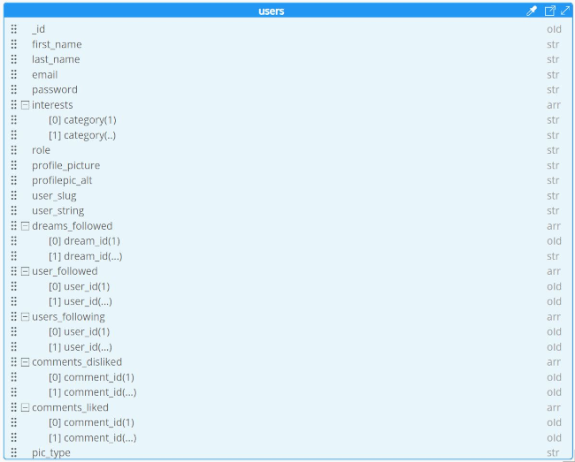

#### dreams

The dreams collection contains details relating to a dream, including the user who created it.  It also tracks who has followed the dream.

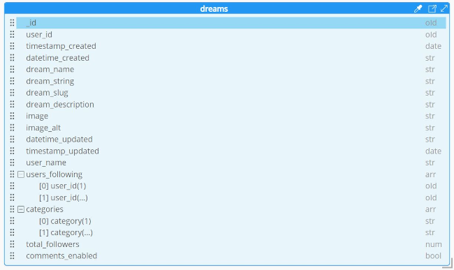

#### comments

The comments collection has been seperated from its related modules to ensure user interaction and reactions are tracked more easily.

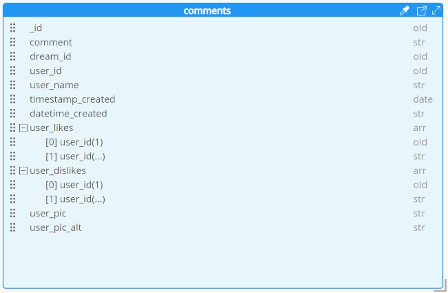

#### categories

Pre-defined categories have been added to simplify the dream creation experience and shorten the user journey.  It will also make drema discovery a lot less hit and miss.  There is potential for user-added categories at a future date but not in this MVP.  Categories also tacks users and dreams selecting them, as well as a count of that data to simplify the front end.

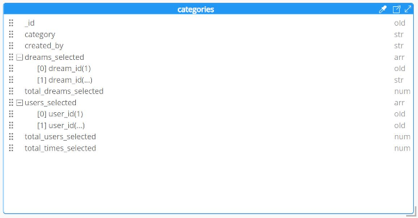

#### avatars

The final collection is a repository of details for pre-defined user avatars, which are randomly assigned to users on sign-up.  It consists solely of the filename to link to the image in cloudinary and the image alt.

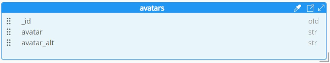

### Feature List
([back to top](#contents))

#### Landing Page and Sign-up

 - Bright, engaging and distinct landing page with clear link to signup process.

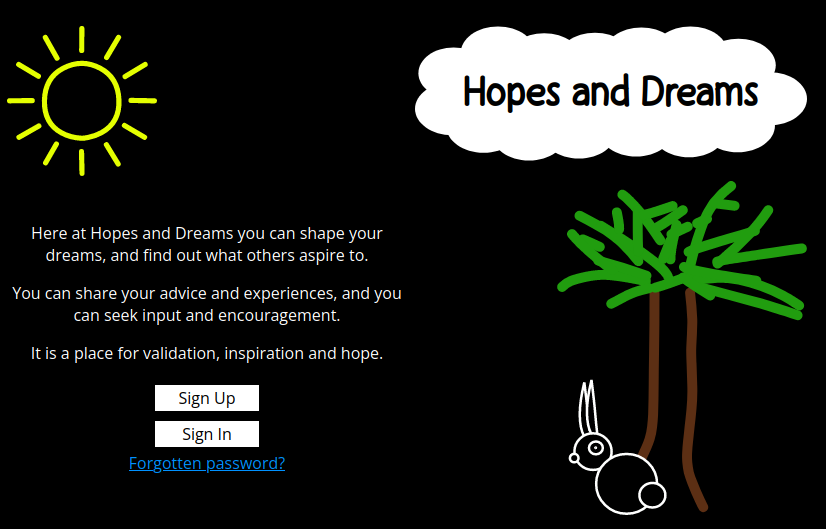

 - Very simple sign-up page developing site brand and theme.

 - Colorful welcome page further building theme, providing affirmation, and explaining site themes.

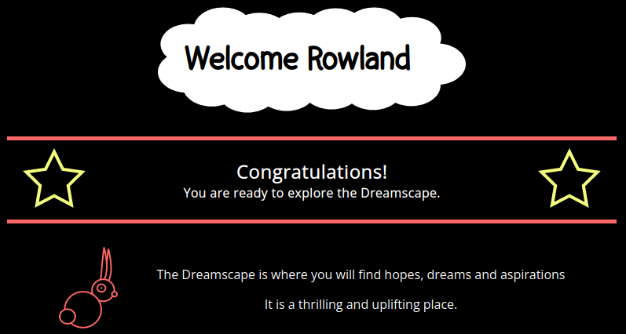

 - Welcome page options provide immediate access to key areas of the site.

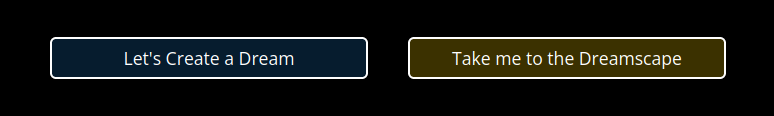

 #### Site Theme and navigation

  - Navigation is clear and obvious where it leads and what page the user is on, and continues site theme established throughout signup.

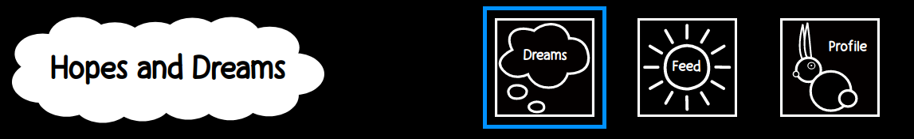

 - Themes established in the styling of the navigation are continued througout the various sections of the site to provide user with a clear sense of where they are.

 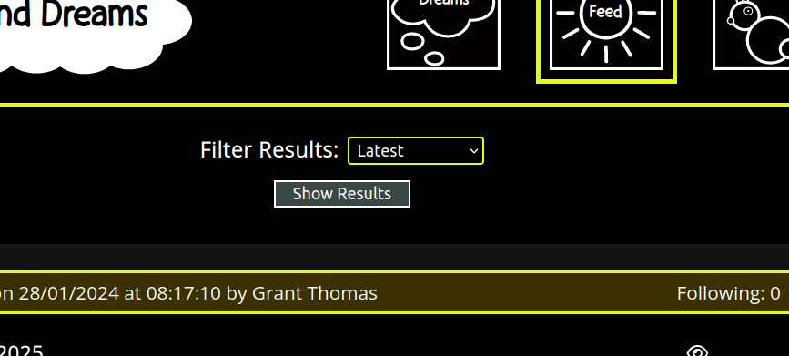

 - Key actions are made easy to access with obvious calls to action.

 - custom 404 page is only served when reaching broken links for dreams to avoid breaking the user's flow, and provides a clear path back to the site.

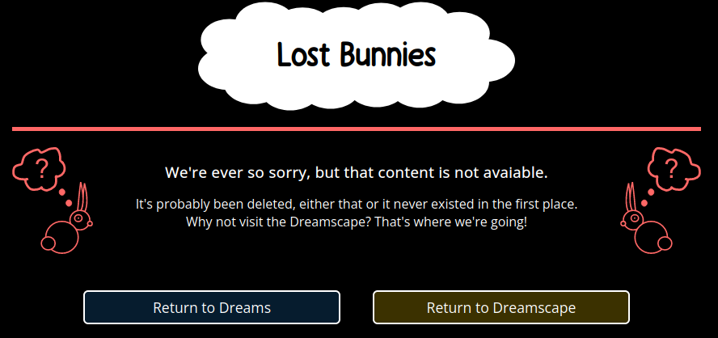

 - fully functional password reset features means users are not at risk of losing access to their account content

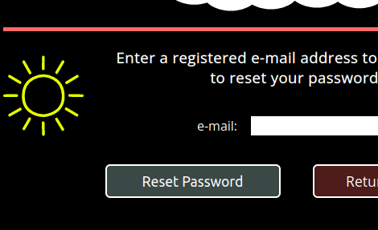

#### Dreams

 - Large , well sited and clearly recognisable icons provide access to key actions relating to a dream.

 - the dream creation category selector (also present in the profile and dream editing) provides point and click interface for selecting categories with user validation and clear messaging if they select too many.

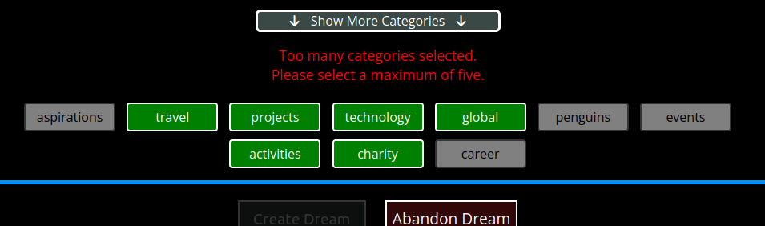

 - option to disable comments when editing or creating a dream as a safeguarding feature.

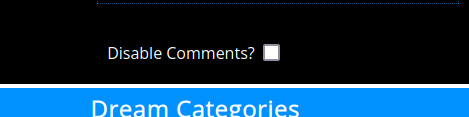

 - users can see previews of any image they upload with the aspect ratio in which they will be displayed - also applies to user profile; all user images are compressed, reformatted and appropriately resized on upload to maintain site performance.

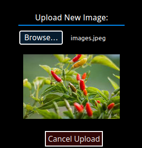

 - users are provided with clear feedback for any action they take relating to a dream.

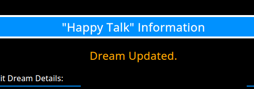

 - users may view their own dreams from the dreams page and review any comments that have been made.

 - users have the freedom to delete any comments relating to their own content which they find unacceptable, as a safeguarding feature.

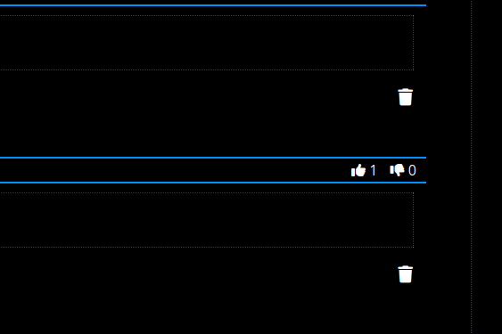

 - users may add comments to a dream with an intuitive interface; all textboxes across the site automatically resize to their content providing a seamless user experience

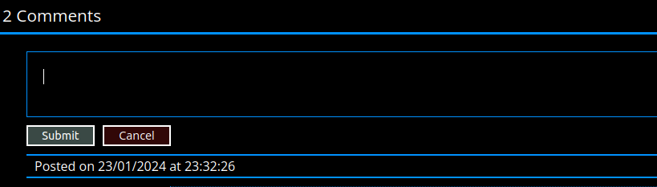

 - users are able to share dreams they like or have created external to Hopes and Dreams; people do not have to be logged in to view them.

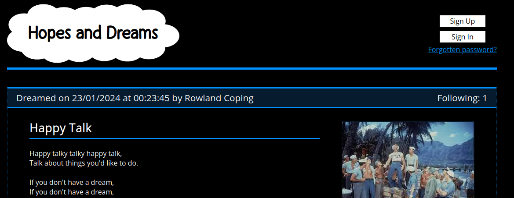

#### Dreamscape Feed

- The user feed can be filtered according to multiple categories - latest, trending (most followers), personalized (matching selected categories on a dream to selected user interests), and followed (matching dreams a user has followed or dreams created by a user they are following).  Users do not see their own dreams in their feed; it is a journey of discovery.

 - follow and unfollow buttons allow the user to follow dreams or users of interest to them and then view them using the 'following' filter.  When following a dream on the feed, the page returns the user to the area of the page they were looking at when they pressed the button, providing a seamless experience.

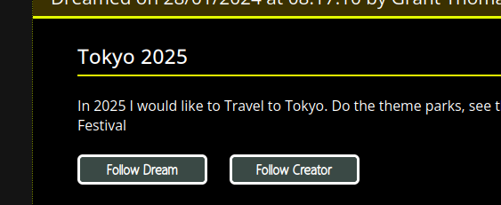

 - users can immediately see from the feed how popular a dream (or their dream in 'view dream') is.

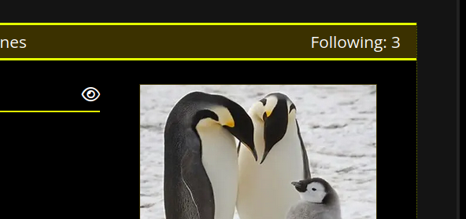

 - comments on the feed are expandable which not only reduce clutter on the feed but allow the user to fully explore any content they are interested in without having to open a new window.

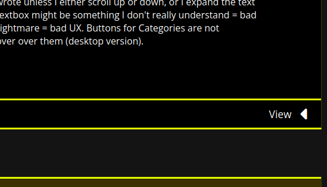

 - Users may like or dislike comments, but only those that other users have focussed.  In doing so provides clear visual feedback as to which comment the user has liked or disliked.  The feed always returns user to the comment they were looking at when they pressed the button.

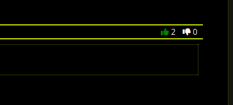

 - users may edit or delete their own comments from within the feed.

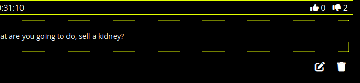

 - on adding, editing, or deleting a comment users are provided with clear feedback inline with the dream affected.  The user's page focus is returned to the dream they were commenting on and if commenting in the feed that set of comments begin in an opened state.  This significantly enhances user experience.

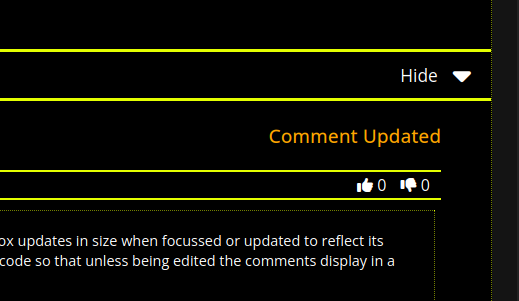

#### Personal Profile

 - Users are allocated an avatar on signup - this can be randomized if they don't like it or alternatively they can upload their own custom image.

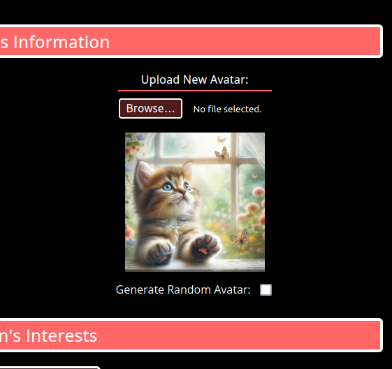

 - As well as editing basic information or selecting interests, users can also log out or reset their password from the profile page.

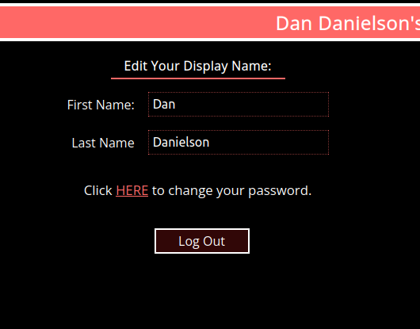

## Testing Documentation
([back to top](#contents))

Please find all testing documentation [HERE](TESTING.md).
  
## Deployment
([back to top](#contents))

### Initial Deployment

Hopes and Dreams has been deployed [HERE](https://hopes-and-dreams-15b83f2d1383.herokuapp.com/) via Heroku, taking the following steps:

Preparing for Deployment:

- For the site to function, I needed to add a Procfile to the repo containing the command to start the app (web: python app.py)
- I already had an up-to-date requirements.txt file in my repository which I updated as I installed new dependencies.  This was a product of developing my project using a virtual environment in VS Code.
- On initial deployment I received error messages related to my image handling code. This was on account of Heroku using a different version of Python which was actually ahead of the official version!  In order to make the app function as intended, I needed to add a runtime.txt file to the repo containing the Python version used for this project (python-3.10.12)

Creating the App and connecting to Github:

- I logged into my Heroku account
- From my Dashboard, I selected 'new' then 'Create new app'
- I selected an available name appropriate to the website - in this case I chose hopes-and-dreams, before selecting my region (Europe) and clicking the 'create app' button.
- Heroku immediately took me to the 'Deploy' page.  From this page I went straight to 'Deployment Method' and clicked on Github.
- Once my Github account was connected, I selected the hopes and dreams repository and clicked 'connect'.
- Once connected I enabled automatic deploys, which means the deployed site automatically updates when it detects a new commit to the linked repository.

Setting up the deployment:

For the site to function I also needed to add the correct environment variables.

- I first went to the settings tab and selected 'Reveal Config Vars' from the 'Config Vars' menu.  
- I then proceeded to add all of my environment variables to this section and save them in turn.
- The final step prior to submission was to ensure the 'DEBUG' environment variable was set to 'false'.

### Deploying this Project

If you wish to deploy this website yourself, here is how to go about it.

#### Create a Version of the repository:

 - Log in to or create your own Github account [HERE](https://github.com/).
 - Go to the lost-king-part1 repository [HERE](https://github.com/rowlandcoping/hopes-and-dreams) and select 'Fork' to create your own snapshot of the repository.

#### Creating your own Heroku Account:

 - Sign in to Heroku [HERE](https://www.heroku.com/).  Keep in mind you will need two-factor authentication to use this website.
 - To use Heroku, unless you have access by some other means, you will need to purchase some platform credits.  For a basic deployment, this won't cost you more than $5/month.

#### Creating the database:

This project uses MongoDB to store all data, therefore you will need a copy of the database to deploy it for yourself.

 - Sign up to MongoDB Atlas [HERE](https://www.mongodb.com/cloud/atlas/register)
 - Create a database (call it what you like, but something indicative of the project is a good idea!)
 - Use the database structure outlined in this readme to re-create the database.  Keep in mind you only need to create the collections - the beauty of MongoDB is that everything else will be created on the fly.
 - Keep in mind if you want administrator access you will have to manually add the key/value pair user: "administrator" to the document for that user in Atlas.

#### Creating a Cloudinary Account:

This project hosts all images on Cloudinary.  In order to do the same you will need a Cloudinary account.

 - Sign up to Cloudinary [HERE](https://cloudinary.com/)

 Creating an email for the password reset functionality:

For this project I used gmail to set up an account through which all password reset e-mails are sent.

 - Set up a gmail account [HERE](https://gmail.com)
 - Once in gmail I set up a specific app password so that the app can connect to it via SMTP.  Find details of this [HERE](https://support.google.com/mail/answer/185833?hl=en-GB).  Keep in mind this app password resets if you change the password of the gmail account!

#### Deploy to Heroku

 - Once all of this is set up, you are ready to deploy - first use the instructions I outlined in the [Initial Deployment](#initial-deployment) section.
 - When it comes to setting up the config vars, you will need to set them up according the details of your own database/cloudinary/gmail accounts.  I have included below a list of all the [environment variables](#hopes-and-dreams-environment-variables) that need to be set up on Heroku, and indeed in any local deployment via an env.py file.

### Continuing the Project

Once the deployment steps have been completed, as above, you will be in a great position to continue the project.  All you will need to do is set up the [environment variables](#hopes-and-dreams-environment-variables) in your chosen development environment.

Using VS Code on Linux:

Using VS Code to continue the project is actually a simple matter because you already have the requirements.txt. I have used it throughout and I have found it straightforward to set it up on a second machine using a venv and the requirements.txt file.

Setting up.

- Install Linux on your machine. You can either dual-boot like I do, or even install a virtual version in Windows.  Either approach is much more straightforward than trying to use VS Code native in Windows, for a number of reasons.  [HERE](https://itsfoss.com/guide-install-linux-mint-16-dual-boot-windows/) is a guide to setting up a dual boot install.
- Install VS Code [HERE](https://code.visualstudio.com/download)
- Click Extensions and search for 'github'.  You want to install 'GitHub Pull Requests and Issues'.
- You should see a github icon you can now use to log in to Github.  Restart VS Code at this point.
- Press CTRL-shift-P to open the command palette and then type 'git:clone'.
- Select this, then click 'clone from github' before selecting your forked repository of Hopes and Dreams.
- Create a folder in an appropriate location.  I save all my repos in a folder called 'repos'.
- You will now be set up and connected to the appropriate repo and the files should all be available in VS CODE, including requirements.txt

Making it work:

- Create an env.py file and a .gitignore file.  Add env.py to your .gitignore file to ensure you don't upload sensitive data to the public repository!
- Ensure you have python3-venv installed ($sudo apt get update, then $sudo apt-get install python3-venv)
- Press CTRL-shift-P again, then type in python: Create Environment.
- Select Venv, then select the recommended settings to create a new virtual environment. It will install all the dependencies outlined in the requirements.txt file.  If it has worked you should see (.venv) in your terminal.  I found depending on the system I had to restart VS Code to make this work.
- Add the [environment variables](#hopes-and-dreams-environment-variables) to your env.py file. Be sure to update the Base_URL to reflect the port you are using locally as opposed to any deployment on Heroku.  Normally it's 127.0.0.1:5000/.
- If you type python3 app.py in your new virtual environment in VS Code, you should see the site working in your if you open the port. You can now continue to develop the project.

### Hopes and Dreams Environment Variables

FLASK:

os.environ.setdefault("IP", "0.0.0.0")\
os.environ.setdefault("PORT", "5000")\
os.environ.setdefault("DEBUG", "False")\
os.environ.setdefault("SECRET_KEY", "xxxxxxxxxxxxx")\
    _this key can be whatever you like_\
os.environ.setdefault("SESSION_COOKIE_SAMESITE", "None")
os.environ.setdefault("SESSION_COOKIE_SECURE", "True")

MONGO DB:

Please note you can set up this connection by logging into Mongo DB then doing as follows:
 - select the database you wish to access
 - select 'connect'
 - select 'drivers', then follow the instructions provided.

os.environ.setdefault("MONGO_URI", "mongodb+srv://xxxxxxxxxxxxxxxxxxxx.mongodb.net/xxxxxxxxxxxx")\
    _these are the details of the database connection_\
os.environ.setdefault("MONGO_DBNAME", "xxx")\
    _this is the name of the database you wish to connect to_\

CLOUDINARY:

All the details for your Cloudinary account are provided on your Cloudinary Dashboard when you log in.

os.environ.setdefault("CLOUD_NAME", "xxxxxxx")\
    _as found on your Cloudinary dashboard_\
os.environ.setdefault("API_KEY", "xxxxxxxxxx")\
    _as found on your Cloudinary dashboard_\
os.environ.setdefault("API_SECRET", "xxxxxxxxxxxxxxx")\
    _as found on your Cloudinary dashboard_\
os.environ.setdefault("CLOUDINARY_BASE", "https://res.cloudinary.com/xxxxxxxxxxxx/image/upload/yyyyyyyyyyyyy/")\
    _this is the base URL for cloudinary images - please note the 'xxxxxxx' portion is the same as your cloud name.  If you view an image in the cloudinary explored and check the 'original url' you will be able to find the second part._

GMAIL:

os.environ.setdefault("MAIL_SERVER", "smtp.gmail.com")\
os.environ.setdefault("MAIL_PORT", "465")\
os.environ.setdefault("MAIL_USE_SSL", "True")\
os.environ.setdefault("MAIL_USERNAME", "xxxxxxxxxxxxx")\
    _the e-mail address you've set up with gmail_\
os.environ.setdefault("MAIL_PASSWORD", "xxxxxxxxxxxxxxxx")\
    _the app password you've set up with gmail_

CUSTOM:

os.environ.setdefault("BASE_URL", "xxxxxxxxxxxxx")\
    _this is the base URL for your site deployment.  For example, for my deployment of Hopes and Dreams this is https://hopes-and-dreams-15b83f2d1383.herokuapp.com, for your localhost it will be something like http://127.0.0.1:5000/_

## Credits
([back to top](#contents))

### Fonts

FONTSPACE: 

CfDavesDreamPersonalRegular-WyAGn.ttf

GOOGLE FONTS:

OpenSans-BoldItalic.ttf\
OpenSans-Bold.ttf\
OpenSans-Italic.ttf\
OpenSans-Regular.ttf

### Images and Icons

IMAGES:

All avatar images were created using Bing Image Creator.
All other site assets were created myself using Inkscape.

As such all images belong to me.

ICONS:

Icons are from Font Awesome.

### Content

 2023 John Hall

### Code

IMAGE HANDLING:

My image handling process was put together using information from the following sources. I believe something has changed in the most recent versions of Python and the .save function is now deprecated, so this code may need to be refactored for future versions of the site.

https://dev.to/feranmiodugbemi/image-conversion-web-app-with-python-1e18
https://stackoverflow.com/questions/33101935/convert-pil-image-to-byte-array
https://gist.github.com/tomvon/ae288482869b495201a0

PASSWORD RESET:

I used the following blog, combined with a great deal of guesswork, to put together the password reset functionality.

https://medium.com/@stevenrmonaghan/password-reset-with-flask-mail-protocol-ddcdfc190968

### Acknowledgments

HELP AND ASSISTANCE:

I have to give enormous credit to my mentor Mitko Bachvarov for his patience and assistance throughout this build.  His feedback about the UI in particular resulted in major changed for the better to the sign-up and editing process - I'm not sure how I would have completed this project to any kind of standard without his input!

DESIGN INSPIRATION:

Strange as this may sound, since I came across it as part of my work I've always wanted to produce a website drawing influence from the design for the Luton Culture website c. 2012-2015.  I always thought it was a great, clean, distinctive design. It has since been re-build in black and white (which I think is a shame), but here is a link from the web archive:

https://web.archive.org/web/20121002225637/http://www.lutonculture.com/wardown-park-museum/

## Technical Information
([back to top](#contents))