# Testing Documentation

([return to README](README.md))

## Contents

### Audit and Validation

[HTML Validation](#html-validation)\
[CSS Validation](#css-validation)\
[JavaScript Validation](#javascript-validation)\
[Python Validation](#python-validation)

### User Story Validation

[Site Owner User Stories](#site-owner-user-stories)\
[Site Visitor User Stories](#site-visitor-user-stories)

### Testing

[Automated Testing](#automated-testing)\
[Manual Testing](#manual-testing)\
[Bugs and Issues](#bugs-and-issues)

## Code Validation

### HTML Validation
([back to top](#testing-documentation))

I have validated the html code by copying and pasting the source code from each page into the w3c validator [HERE](https://validator.w3.org/).  When formatting the code I have decided to format the Jinja2 templating without indents to preserve the integrity of the HTML.

Please note I have not validated (or styled) the admin only pages as they are not intended to be user facing.\
Only myself and the user created for assessment purposes will have admin access for this iteration of the site.

Page validated: Landing Page\
URL: https://hopes-and-dreams-15b83f2d1383.herokuapp.com/ \
Repaired Issues: Missing image alt tags.\
Outstanding Issues: None.

Page validated: Signup Page\
URL: https://hopes-and-dreams-15b83f2d1383.herokuapp.com/dare-to-dream \
Repaired Issues: H2 tag not closed, missing image alts, stray closing tag for div.\
Outstanding Issues: None.

Page validated: Password Reset Page\
URL: https://hopes-and-dreams-15b83f2d1383.herokuapp.com/password-reset \
Repaired Issues: Missing image alts.\
Outstanding Issues: None.

Page validated: Password Reset Page (Dream Route)\
URL: https://hopes-and-dreams-15b83f2d1383.herokuapp.com/password-reset-dream/compete-at-le-mans \
Repaired Issues: Missing image alts.\
Outstanding Issues: None.

Page validated: Reset Password Page\
URL: https://hopes-and-dreams-15b83f2d1383.herokuapp.com/reset-password/xxxxxxxresetkeyxxxxxxxxx \
Repaired Issues: Missing image alts.\
Outstanding Issues: None.

Page validated: 404 Page\
URL: https://hopes-and-dreams-15b83f2d1383.herokuapp.com/lost-bunnies \
Repaired Issues: Missing image alts.\
Outstanding Issues: None.

Page validated: View Dream Page\
URL: https://hopes-and-dreams-15b83f2d1383.herokuapp.com/dream/compete-at-le-mans \
Repaired Issues: Missing image alts, duplicate IDs for feed images.\
Outstanding Issues: None.

Page validated: Welcome Page\
URL: https://hopes-and-dreams-15b83f2d1383.herokuapp.com/welcome \
Repaired Issues: Missing image alts, duplicate IDs for intro text (not used anywhere!).\
Outstanding Issues: None.

Page validated: Create Dream Page\
URL: https://hopes-and-dreams-15b83f2d1383.herokuapp.com/dream/compete-at-le-mans \
Repaired Issues: stray/erroneous tags, table issues requiring major refactoring, missing image alts.\
Outstanding Issues: None.

Page validated: Dream Image Upload Page\
URL: https://hopes-and-dreams-15b83f2d1383.herokuapp.com/image-upload/compete-at-le-mans \
Repaired Issues: missing image alts, stray/erroneous tags, an empty javascript-populated field, misdirected labels.\
Outstanding Issues: None.

Page validated: Edit Dream Page\
URL: https://hopes-and-dreams-15b83f2d1383.herokuapp.com/edit-dream/compete-at-le-mans \
Repaired Issues: missing image alts, stray/erroneous tags, misdirected labels, table issues requiring major refactoring.\
Outstanding Issues: None.

Page validated: Personal Profile Page\
URL: https://hopes-and-dreams-15b83f2d1383.herokuapp.com/profile \
Repaired Issues: missing image alts, stray/erroneous tags, misdirected labels.\
Outstanding Issues: None.

Page validated: Dreamscape\
URL: https://hopes-and-dreams-15b83f2d1383.herokuapp.com/dreamscape \
Repaired Issues: duplicate ids in multiple places, stray tags, missing image alts, misdirected label.\
Outstanding Issues: None.

Page validated: Dreams\
URL: https://hopes-and-dreams-15b83f2d1383.herokuapp.com/dreams \
Repaired Issues: duplicate ids in multiple places, stray tags, missing image alts.\
Outstanding Issues: None.

### CSS Validation
([back to top](#testing-documentation))

File Validated: style.css\
URL: https://hopes-and-dreams-15b83f2d1383.herokuapp.com/ \
Repaired Issues: 4 errors total - invalid font-style and ineligable margin values (due to typo).\
Outstanding Issues: None.

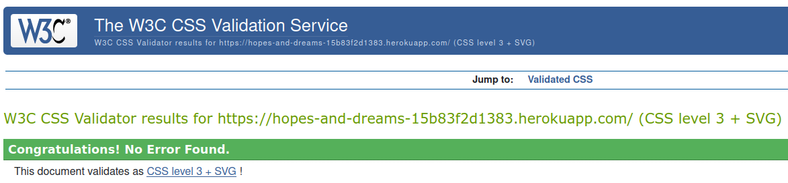

### JavaScript Validation
([back to top](#testing-documentation))

I have validated my JavaScript file using [JSHint](https://jshint.com/)

Repaired Issues: There were a number of missing semicolons and some undeclared variables, but no major issues.\
Outstanding Issues: None.

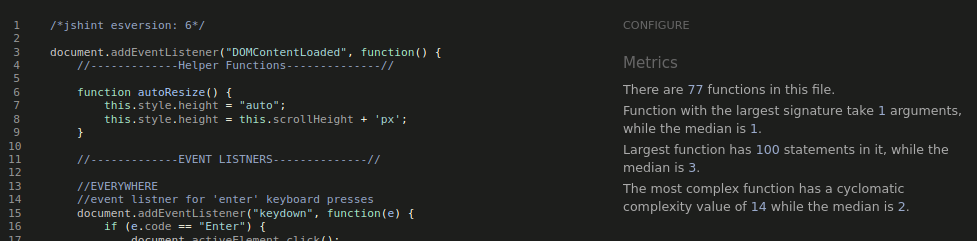

### Python Validation
([back to top](#testing-documentation))

I have used the [CI Python Linter](https://pep8ci.herokuapp.com/#) to ensure my app.py file is PEP 8 compliant.

Repaired Issues: The majority of issues involved whitespace, intentation or line length issues.\
Outstanding Issues: None.

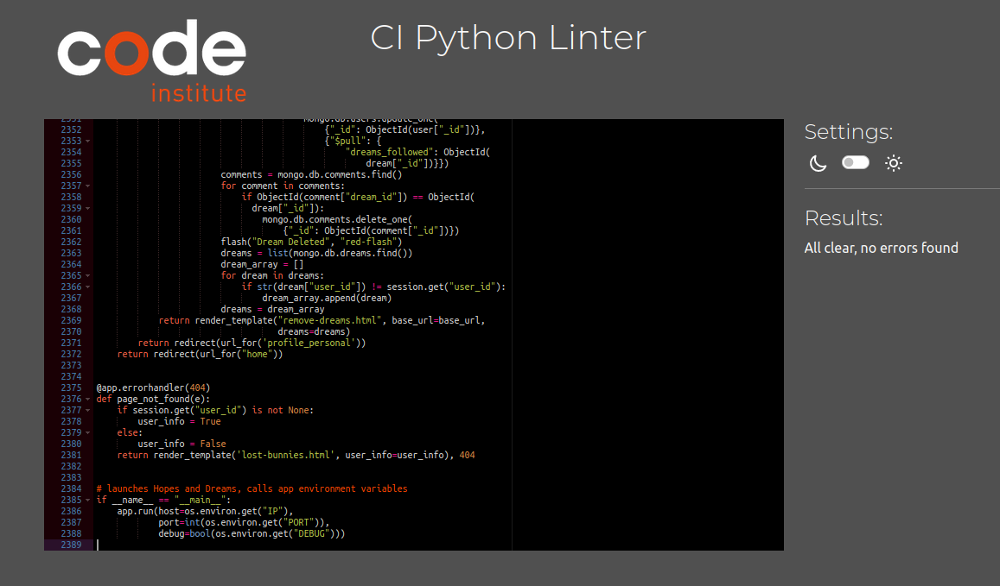

## User Stories
([back to top](#testing-documentation))

### Site Owner User Stories

([back to top](#testing-documentation))

_"Brand Identity: The branding needs to be strong and clear from page one"_\
The art style and color palate is clearly established on the landing page and continued throughout the signup process.

_"The site mission and purpose needs to be clearly stated to encourage sign-up.  It needs to inspire people."_\
The landing page includes a site description which alongside the imagary is designed to inspire curiosity.

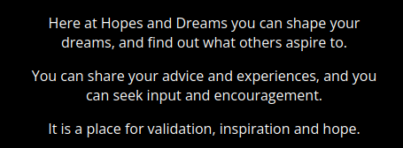

_"...users need a simple sign-up process just as soon as they hit the homepage."_\
The sign-up process has been reduced to a single page and is immediately accessible from the homepage.

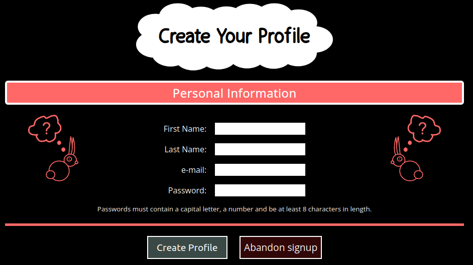

_"I want the UI to be a stripped down and simple as possible so that it functions as well on mobile as it does on desktop_"\
The UI has been designed with big, colorful icons and buttons which make the site easy and intuitive to use on any platform.

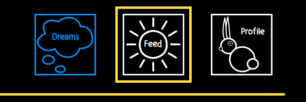

_"As soon as (the user) have signed up and land in the site for the first time, the question 'what do I do now' needs to be answered._"\
The welcome page provides a detailed introduction to the site and an immediate option to either create a dream or visit the feed.

_"Logic for displaying dreams must be clean and effective."_\
Dream display consists of a feed which can be filtered by a number of easy to understand criteria - dreams can be filtered chronologically, by popularity (most followers), matched by category to user interests, or according to those that a specific user is following.

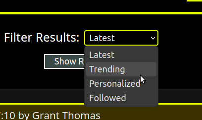

### Site Visitor User Stories
([back to top](#testing-documentation))

_"The homepage needs to give users instant motivation to sign up, through brand imagery and a clear concept."_\
The imagery and concept combine to generate a sense of curiosity which encourages user sign-up.

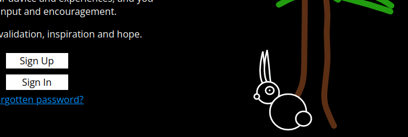

_"The user journey needs to be interesting, but not too long, particularly through the sign-up phase."_\
The signup now consists of a one page form and a welcome page, which introduces users to core site concepts.  Both pages also consolidate core branding and themes.

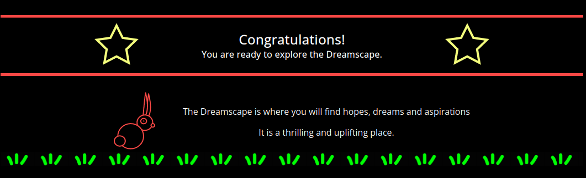

_"Quick and intuitive UI: to avoid drop-outs the user should not be hunting for anything."_\
Key site content and activities are immediately discoverable both through the bright, clear navigation and large, obviously sited buttons.

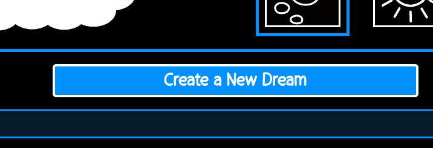

_"Customisable look and feel: People like to be able to make their corner of the web their own."_\
Users are able to either create their own avatars or randomly generate a brand new cute fluffy friend from the database, which will appear next to all their comments.

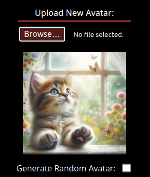

_"Feeds need to reflect what people are following and the things they have interest in..."_\
The feed filter can be used to focus on followed dreams, or user interests can be tailored to produce a relevant personalized feed.

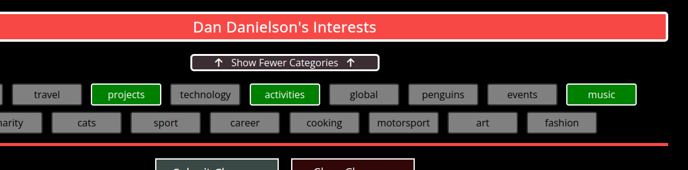

_"Users need to feel ... that they have control over comments and content they see."_\
Users may delete any comments on their own dreams they find unacceptable, or if they prefer disable comments entirely.

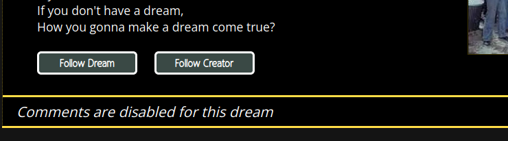

## Testing
([back to top](#testing-documentation))

### Automated Testing
([back to top](#testing-documentation))

Automated testing has not been included in this project for a number of reasons:
 - I do not know how to set up automatic tests for Flask applications written in Python, which forms the majority of the codebase, and since the suject of automatically testing Python scripts has not been mentioned at all in the course material it won't form part of the assessment criteria.
 - What Javascript there is performs straightforward DOM functions and can more easily be tested manually.
 - The time it would take to set up automated testing environments and then learning how to use them are simply not practical given the timescales involved with this project.

My view is that given the scope of the project and the above constraints it is a lot more practical and sensible to put together a comprehensive suite of manual tests to assess core functionality of each page, than it would be to put into place automated testing procedures.

### Manual Testing
([back to top](#testing-documentation))

#### Manually Testing Page Functionality

For me the most sensible way of approaching this is to systematically check the functionality on every page to ensure that everything appears as intended when an action is taken on the site and that the database is updated accoringly.  As such I've created a table for each of the pages on the site and tested all of the features therein.

LANDING PAGE:

| Feature Tested                        | Expected Outcome                 | Result  |
| ------------------------------------- | -------------------------------- | ------- |
| DOM | all page elements load as expected | Success |
| DOM | all interactable elements change on hover and show pointer | Success |
| Sign-in button | reveals form fields and hides sign up button | Success |
| Cancel button | hides form fields and reveals sign up button | Success |
| email field | highlights when selected | Success |
| email field | required field must be populated to submit form | Success |
| email field | must be in correct format to submit form | Success |
| password field | highlights when selected | Success |
| password field | required field must be populated to submit form | Success |
| password field | must be in correct format to submit form | Success |
| submit button | submits data to database and loads dreamscape if form correctly completed and user details correct | Success |
| submit button | creates new user session if form correctly completed and user details correct | Success |
| submit button | Will not submit data if form not correctly filled out | Success |
| submit button | returns to landing page and displays error message if e-mail does not exist | Success |
| submit button | returns to landing page and displays error message if password is incorrect | Success |
| Forgotten password link | takes user to the password reset page | Success |
| sign up button | takes user to the user sign-up page | Success |
| manually editing url to non-existent address | takes user to 404 | Success |

SIGN UP PAGE:

| Feature Tested                        | Expected Outcome                 | Result  |
| ------------------------------------- | -------------------------------- | ------- |
| DOM | all page elements load as expected | Success |
| DOM | all interactable elements change on hover and show pointer | Success |
| First name field | highlights when selected | Success |
| First name field | required field must be populated to submit form | Success |
| Last name field | highlights when selected | Success |
| Last name field | required field must be populated to submit form | Success |
| email field | highlights when selected | Success |
| email field | required field must be populated to submit form | Success |
| email field | must be in correct format to submit form | Success |
| password field | highlights when selected | Success |
| password field | required field must be populated to submit form | Success |
| password field | must be in correct format to submit form | Success |
| abandon button | takes user back to the landing page | Success |
| submit button | submits data to back-end and loads welcome page if form correctly completed | Success |
| submit button | Will not submit data if form not correctly filled out | Success |
| On submit | First Name field populated in database | Success |
| On submit | Last Name field populated in database | Success |
| On submit | user string created and populated in database | Success |
| On submit | user slug created and populated in database, with correct adjustment for duplicate names | Success |
| On submit | e-mail address populated in database | Success |
| On submit | password hashed and populated in database | Success |
| On submit | role is sssigned as "user" and populated in database | Success |
| On submit | a user avatar is randonly selected and the url saved to the database | Success |
| On submit | the image alt for the random avatar is saved to the database | Success |
| On submit | the pic_type is set to "system" and populated in the database | Success |
| On submit | a new session is created for the user | Success |
| manually editing url to non-existent address | takes user to 404 | Success |

WELCOME PAGE:

| Feature Tested                        | Expected Outcome                 | Result  |
| ------------------------------------- | -------------------------------- | ------- |
| DOM | all page elements load as expected | Success |
| DOM | all interactable elements change on hover and show pointer | Success |
| Let's Create a Dream button | takes user to 'Dreambuilder' (create dream) page | Success |
| Take me to the Dreamscape button | takes user to the 'Dreamscape' (feed) | Success |
| manually editing url to non-existent address | takes user to 404 | Success |

PASSWORD RESET PAGE:

| Feature Tested                        | Expected Outcome                 | Result  |
| ------------------------------------- | -------------------------------- | ------- |
| DOM | all page elements load as expected | Success |
| DOM | all interactable elements change on hover and show pointer | Success |
| Return to Homepage | Displays if user came from landing page | Success |
| Return to Profile | Displays if user came from profile page | Success |
| email field | highlights when selected | Success |
| email field | required field must be populated to submit form | Success |
| email field | must be in correct format to submit form | Success |
| reset password button | Will not submit data if form not correctly filled out | Success |
| reset password button | submits data and re-routes user with confirmation message if form correctly completed | Success |
| reset password button | if e-mail does not exist re-loads page with error message | Success |
| on successful submit | reset token created and e-mail sent to the user with message | Success |
| on successful submit (if user was logged out) | returns user to landing page and displays confirmation message | Success |
| on successful submit (if user was logged in) | returns user to profile page | Success |
| on clicking link sent to e-mail | returns user to reset-password page with correct token | Success|
| manually editing url to non-existent address | takes user to 404 | Success |

PASSWORD RESET PAGE (DREAM):

| Feature Tested                        | Expected Outcome                 | Result  |
| ------------------------------------- | -------------------------------- | ------- |
| DOM | all page elements load as expected | Success |
| DOM | all interactable elements change on hover and show pointer | Success |
| Return to Dream | Returns user to the dream they were looking at | Success |
| email field | highlights when selected | Success |
| email field | required field must be populated to submit form | Success |
| email field | must be in correct format to submit form | Success |
| reset password button | Will not submit data if form not correctly filled out | Success |
| reset password button | submits data and re-routes user with confirmation message if form correctly completed | Success |
| reset password button | if e-mail does not exist re-loads page with error message | Success |
| on submit | reset token created and e-mail sent to the user with message | Success |
| on submit | returns user to dream they were viewing and displays confirmation message | Success |
| on clicking link sent to e-mail | returns user to reset-password page with correct token | Success|
| manually editing first part of url to non-existent address | takes user to 404 | Success |
| manually editing any part of the dream slug in the url | remains on the same page | Success |
| Return to Dream | returns 404 if dream slug does not exist after editing | Success |

RESET PASSWORD:

| Feature Tested                        | Expected Outcome                 | Result  |
| ------------------------------------- | -------------------------------- | ------- |
| DOM | all page elements load as expected | Success |
| DOM | all interactable elements change on hover and show pointer | Success |
| Return to Homepage | Returns user to homepage | Success |
| password field | highlights when selected | Success |
| password field | required field must be populated to submit form | Success |
| password field | must be in correct format to submit form | Success |
| reset password button | Will not submit data if form not correctly filled out | Success |
| reset password button | submits data and re-routes user with confirmation message if form correctly completed | Success |
| on submit | reset token securely identifies correct user and creates new hashed password in database | Success |
| on submit | user is returned to homepage with success message | Success |
| on login | new password works | Success |
| manually editing token | returns page with token not valid message | Success |
| manually editing first part of url to non-existent address | takes user to 404 | Success |

LOST BUNNIES (404 PAGE):

| Feature Tested                        | Expected Outcome                 | Result  |
| ------------------------------------- | -------------------------------- | ------- |
| DOM | all page elements load as expected | Success |
| DOM | all interactable elements change on hover and show pointer | Success |
| (if signed out) | Displays sign up / sign in buttons and link to homepage | Success |
| Return to Homepage button (if signed out) | returns user to landing page | Success |
| Sign-in button (if signed out) | reveals form fields and hides sign up button | Success |
| Cancel button (if signed out) | hides form fields and reveals sign up button | Success |
| email field (if signed out) | highlights when selected | Success |
| email field (if signed out) | required field must be populated to submit form | Success |
| email field (if signed out) | must be in correct format to submit form | Success |
| password field (if signed out) | highlights when selected | Success |
| password field (if signed out) | required field must be populated to submit form | Success |
| password field (if signed out) | must be in correct format to submit form | Success |
| submit button (if signed out) | submits data to database and loads dreamscape if form correctly completed | Success |
| submit button (if signed out) | creates new user session if form correctly completed and user details correct | Success |
| submit button (if signed out) | Will not submit data if form not correctly filled out | Success |
| submit button (if signed out) | returns to landing page and displays error message if e-mail does not exist | Success |
| submit button (if signed out) | returns to landing page and displays error message if password is incorrect | Success |
| (if signed in) | Displays return to dreams and return to dreamscape options | Success |
| Return to Dreams (if signed in) | Returns user to dreams page | Success |
| Return to Dreamscape (if signed in) | Returns user to dreamscape page | Success |

MAIN TEMPLATE:

| Feature Tested                        | Expected Outcome                 | Result  |
| ------------------------------------- | -------------------------------- | ------- |
| Main logo | disaplys as expected | Success |
| navigation icons | Display as expected | Success |
| Dreams icon | image and text changes on mouseover | Success |
| Feed icon | image and text changes on mouseover | Success |
| Profile | image and text changes on mouseover | Success |
| DOM | all interactable elements show pointer on mouseover | Success |
| Selected Page | Routing displays selected page box as expected | To be tested on page by page basis |
| (if signed out) | sign-in/sign-out/password reset buttons displayed instead of navigation on view dream page | Success |
| Sign-in button (if signed out) | reveals form fields and hides sign up button | Success |
| Cancel button (if signed out) | hides form fields and reveals sign up button | Success |
| email field (if signed out) | highlights when selected | Success |
| email field (if signed out) | required field must be populated to submit form | Success |
| email field (if signed out) | must be in correct format to submit form | Success |
| password field (if signed out) | highlights when selected | Success |
| password field (if signed out) | required field must be populated to submit form | Success |
| password field (if signed out) | must be in correct format to submit form | Success |
| submit button (if signed out) | submits data to database and re-loads the correct dream | Success |
| submit button (if signed out) | creates new user session if form correctly completed and user details correct | Success |
| submit button (if signed out) | Will not submit data if form not correctly filled out | Success |
| submit button (if signed out) | returns to the same dream and displays error message if e-mail does not exist | Success |
| submit button (if signed out) | returns to the same dream and displays error message if password is incorrect | Success |

DREAMS PAGE:

| Feature Tested                        | Expected Outcome                 | Result  |
| ------------------------------------- | -------------------------------- | ------- |
| DOM | all page elements load as expected | Success |
| navigation icons | selected page box set to dreams icon | Success |
| Create New Dream button | takes user to Dreambuilder page (create dream) | Success |
| Create New Dream button | color and pointer change on mouseover | Success |
| Edit dream icon | takes user to edit the selected dream | Success |
| Delete Dream Icon | color and pointer change on mouseover | Success |
| Delete Dream Icon | on click opens confirmation box for selected dream | Success |
| Delete Dream Alert | all other navigation on page disabled | Success |
| Delete Dream Alert | all other content on page greyed out | Success |
| Delete Dream Alert Cancel Button | closes the alert and returns the page to a normal state | Success |
| Delete Dream Confirm Button | tells server to delete selected dream and returns confirmation message | Success |
| on dream delete | selected dreams is deleted and page is returned without it displaying | Success |
| on dream delete | the dream id is removed from the 'dreams_followed' array of any user following it | Success |
| on dream delete | all comments on the dream are deleted | Success |
| on dream delete | the dream id is removed from the 'dreams_selected' array for any categories selected | Success |
| on dream delete | for any categories selected the 'total_dreams_selected' number is decremented by 1 | Success |
| on dream delete | for any categories selected the 'total_times_selected' number is decremented by 1 | Success |
| on dream delete | if present, the image for the dream is deleted from the 'dreams' Cloudinary folder | Success |
| View Dream Icon | color and pointer change on mouseover | Success |
| View Dream Icon | on click opens view dream page for selected dream | Success |
| manually editing url to non-existent address | takes user to 404 | Success |

CREATE DREAM PAGE:

| Feature Tested                        | Expected Outcome                 | Result  |
| ------------------------------------- | -------------------------------- | ------- |
| DOM | all page elements load as expected | Success |
| DOM | all interactable buttons change on hover and show pointer | Success |
| navigation icons | selected page box set to dreams icon | Success |
| My Dream input | highlights on focus | Success |
| My Dream input | user input is duplicated in mobile and desktop versions of the form | Success |
| My Dream input | required field must be populated to submit form | Success |
| Dream Description textarea | highlights on focus | Success |
| Dream Description textarea | user input is duplicated in mobile and desktop versions of the form | Success |
| Dream Description textarea | required field must be populated to submit form | Success |
| Dream Description textarea | re-sizes automatically | Success |
| Disable comments checkbox | styled in line with page on click | Success |
| Show more categories button | displays up to 10 additional categories to select from | Success |
| Show all categories button | displays all categories to select from | Success |
| Show fewer | displays fewer categories to select from | Success |
| category buttons | First ten category buttons displayed on page load | Success |
| category buttons | Change color to green when selected | Success |
| category buttons | change color to grey when deselected | Success |
| category buttons | When selected adds category to hidden input field | Success |
| category buttons | When deselected removes category from hidden input field | Success |
| category buttons | if too many selected warning message appears and submit button disabled | Success |
| category buttons | if correct number selected warnign message disappears and submit button enabled | Success |
| Abandon Dream button | returns user to dreams page | Success |
| submit button | submits data to back-end and progresses to image upload page if fields correct | Success |
| submit button | Will not submit data if form not correctly filled out | Success |
| submit button | Returns warning message from server and reloads the page if dream name is a duplicate for the user | Success |
| On submit | timestamp created field populated in database | Success |
| On submit | datetime created field populated in database | Success |
| On submit | datetime created field populated in database | Success |
| On submit | Dream Name field populated in database | Success |
| On submit | dream string created and populated in database | Success |
| On submit | dream slug created and populated in database, with correct adjustment for duplicate names | Success |
| On submit | Dream Description field populated in database | Success |
| On submit | Categories Selected field populated in database as an array of categories | Success |
| On submit | 'dreams_selected' array for selected categories updated with dream id | Success |
| On submit | for any categories selected the 'total_dreams_selected' number is incremented by 1 | Success |
| On submit | for any categories selected the 'total_times_selected' number is incremented by 1 | Success |
| On submit | user_id field populated in database | Success |
| On submit | user name field populated in database | Success |
| On submit | comments enabled boolean populated in database | Success |
| manually editing url to non-existent address | takes user to 404 | Success |

IMAGE UPLOAD PAGE:

| Feature Tested                        | Expected Outcome                 | Result  |
| ------------------------------------- | -------------------------------- | ------- |
| DOM | all page elements load as expected | Success |
| DOM | all interactable buttons change on hover and show pointer | Success |
| navigation icons | selected page box set to dreams icon | Success |
| I'll do this later button | returns user to dreams page | Success |
| Browse button | Allows user to select an image to upload | Success |
| On selecting file | file is previewed on page | Success |
| On selecting file | select and cancel buttons visible | Success |
| On selecting file | any existing image is hidden | Success |
| Cancel Upload Button | removes previewed image, hides preview display and buttons, shows existing image (if any) | Success |
| Upload Image Button | passes file to server, returns user to Dreams page, displays success message | Success |
| On upload | image is compressed and converted to webp format, resized to 400pxx wide | Success |
| On upload | filename for image is created using user ID and existing filename. | Success |
| On upload | new image filename is saved to database. | Success |
| On upload | generated image alt is saved to database. | Success |
| On upload | image is uploaded to the cloudinary 'dreams' folder | Success |
| On upload | any existing image deleted from the cloudinary 'dreams' folder | Success |
| manually editing url to non-existent address | takes user to 404 | Success |
| manually editing dream slug to non-existent address or another user's dream | takes user to dreams page with error message | Success |

EDIT DREAM PAGE:

| Feature Tested                        | Expected Outcome                 | Result  |
| ------------------------------------- | -------------------------------- | ------- |
| DOM | all page elements load as expected | Success |
| DOM | all interactable buttons change on hover and show pointer | Success |
| navigation icons | selected page box set to dreams icon | Success |
| My Dream input | highlights on focus | Success |
| My Dream input | displays dream name for selected dream | Success |
| My Dream input | user input is duplicated in mobile and desktop versions of the form | Success |
| My Dream input | required field must be populated to submit form | Success |
| Dream Description textarea | displays dream description for selected dream | Success |
| Dream Description textarea | expands to contain text on click | Success |
| Dream Description textarea | highlights on focus | Success |
| Dream Description textarea | user input is duplicated in mobile and desktop versions of the form | Success |
| Dream Description textarea | required field must be populated to submit form | Success |
| Dream Description textarea | re-sizes automatically | Success |
| Disable comments checkbox | styled in line with page on click | Success |
| Disable comments checkbox | correctly shows current state for dream | Success |
| Show fewer | displays fewer categories to select from | Success |
| Show more categories button | displays up to 10 additional categories to select from | Success |
| Show all categories button | displays all categories to select from | Success |
| category buttons | All category buttons displayed on page load | Success |
| category buttons | Selected dream's categories highlighted green on page load | Success |
| category buttons | on click change color to green when selected | Success |
| category buttons | on click change color to grey when deselected | Success |
| category buttons | When selected adds category to hidden input field | Success |
| category buttons | When deselected removes category from hidden input field | Success |
| category buttons | if too many selected warning message appears and submit button disabled | Success |
| category buttons | if correct number selected warnign message disappears and submit button enabled | Success |
| Browse button | Allows user to select an image to upload | Success |
| On selecting file | file is previewed on page | Success |
| On selecting file | cancel button visible | Success |
| On selecting file | any existing image is hidden | Success |
| Cancel Upload Button | removes previewed image, hides preview display and buttons, shows existing image (if any) | Success |
| Clear Changes button | refreshes page, restoring data to original state | Success |
| submit button | submits data to back-end, refreshes page with new data and confirmation message if fields correct | Success |
| submit button | Will not submit data if form not correctly filled out | Success |
| submit button | Returns warning message from server and reloads the page if dream name is a duplicate for the user | Success |
| On submit | timestamp updated field updated in database | Success |
| On submit | datetime updated field updated in database | Success |
| On submit | Dream Name field updated in database | Success |
| On submit | dream string created and updated in database | Success |
| On submit | dream slug created and updated in database, with correct adjustment for duplicate names | Success |
| On submit | Dream Description field updated in database | Success |
| On submit | Categories Selected field updated in database as an array of categories | Success |
| On submit | 'dreams_selected' array for selected categories updated with dream id | Success |
| On submit | for any categories selected the 'total_dreams_selected' number is incremented by 1 | Success |
| On submit | for any categories selected the 'total_times_selected' number is incremented by 1 | Success |
| On submit | for any categories removed the 'total_dreams_selected' number is decremented by 1 | Success |
| On submit | for any categories removed the 'total_times_selected' number is decremented by 1 | Success |
| On submit | comments enabled boolean updated in database | Success |
| On submit | page is returned with new dream url if name changed | Success |
| On upload | if added image is compressed and converted to webp format, resized to 400pxx wide | Success |
| On upload | if added filename for image is created using user ID and existing filename. | Success |
| On upload | if added new image filename is saved to database. | Success |
| On upload | if added generated image alt is saved to database. | Success |
| On upload | if added image is uploaded to the cloudinary 'dreams' folder | Success |
| On upload | if added any existing image deleted from the cloudinary 'dreams' folder | Success |
| On upload | if remove image button checked existing image deleted from the cloudinary 'dreams' folder | Success |
| On upload | if remove image button checked image url removed from dream | Success |
| manually editing url to non-existent address | takes user to 404 | Success |
| manually editing dream slug to non-existent address or another user's dream | takes user to dreams page with error message | Success |

VIEW DREAM PAGE

| Feature Tested                        | Expected Outcome                 | Result  |
| ------------------------------------- | -------------------------------- | ------- |
| DOM | all page elements load as expected | Success |
| DOM | all interactable buttons change on hover and show pointer | Success |
| navigation icons | selected page box set to dreams icon for all return routes | Success |
| Return to Dreams button | returns user to dreams page | Success |
| Disabled Comments | comments disabled message appears if comments disabled set to true | Success |
| Add Comment button | opend text box to add a comment | Success |
| Add Comment button | hides icons to edit or delete a comment | Success |
| Add Comment button | displays submit and cancel buttons | Success |
| Add Comment cancel button | returns page to original state | Success |
| Add Comment textarea | resizes to match text | Success |
| Add Comment submit button | sends data to server, provides feedback message | Success |
| Add Comment submit button | once submitted, returns page to original state and re-centers view on the comments section | Success |
| Add Comment on submit | adds comment and returns success message | Success |
| Add Comment on submit | If comment text matches an existing comment, returns warning message | Success |
| Add Comment on submit | Adds comment to comment field in database | Success |
| Add Comment on submit | Adds user id to comment in database | Success |
| Add Comment on submit | Adds dream id to comment in database | Success |
| Add Comment on submit | Adds user name to comment in database | Success |
| Add Comment on submit | Adds timestamp to comment in database | Success |
| Add Comment on submit | Adds datetime created to comment in database | Success |
| Add Comment on submit | Adds user avatar to comment in database | Success |
| Add Comment on submit | Adds user avatar alt to comment in database | Success |
| Edit comment icon | hides div displaying text, and opens and focusses the textbox | Success |
| Edit comment icon | hides add and delete options, and disaplys confirm and cancel buttons | Success |
| Edit comment textbox | automatically resizes to width of the page and the text contained within | Success |
| Edit comment cancel button | returns the page to its original state with text reverted to the original comment | Success |
| Edit comment submit button | sends data to server, provides feedback message | Success |
| Edit comment submit button | once submitted, returns page to original state and re-centers view on the comments section | Success |
| Edit comment on submit | edits comment and returns success message | Success |
| Edit comment on submit | If comment text matches an existing comment, returns warning message | Success |
| Edit comment on submit | Updates comment in comment field in database | Success |
| Delete comment Icon | on click opens confirmation box for selected dream | Success |
| Delete comment Alert | all other navigation on page disabled | Success |
| Delete comment Alert | all other content on page greyed out | Success |
| Delete comment Alert Cancel Button | closes the alert and returns the page to a normal state | Success |
| Delete comment Confirm Button | tells server to delete selected comment and returns confirmation message | Success |
| Delete comment on submit | deletes comment from database | Success |
| comment delete return code | returns dream page and re-centers view on the updated comments section | Success |
| Comment like button | submits like, returns page with updated icon, focusses page on the affected comment | Success |
| On like | user id is added to user likes array in the comment | Success |
| On like | comment id is added to comments liked array in user | Success |
| Comment unlike button | submits like, returns page with updated icon, focusses page on the affected comment | Success |
| On unlike | user id is removed from user likes array in the comment | Success |
| On unlike | comment id is removed from comments liked array in user | Success |
| Comment dislike button | submits dislike, returns page with updated icon, focussed page on the affected comment | Success |
| On dislike | user id is added to user dislikes array in the comment | Success |
| On dislike | comment id is added to comments disliked array in user | Success |
| Comment undislike button | submits undislike, returns page with updated icon, focussed page on the affected comment | Success |
| On undislike | user id is removed from user dislikes array in the comment | Success |
| On undislike | comment id is removed from comments disliked array in user | Success |
| Follow Dream Button | submits follow, returns page with updated icon | Success |
| On follow dream | user id is added to users following array in the dream | Success |
| On follow dream | dream id is added to dreams followed array in user | Success |
| On follow dream | total followers number in dreams is incremented by 1 | Success |
| Unfollow Dream Button | submits unfollow, returns page with updated icon | Success |
| On unfollow dream | user id is removed from users following array in the dream | Success |
| On unfollow dream | dream id is removed from dreams followed array in user | Success |
| On unfollow dream | total followers number in dreams is decremented by 1 | Success |
| Follow Creator Button | submits follow, returns page with updated icon | Success |
| On follow user | user id is added to the followed user's users following array | Success |
| On follow user | followed user's id is added to users followed array in user | Success |
| Unfollow Creator Button | submits unfollow, returns page with updated icon | Success |
| On unfollow user | user id is removed from the followed user's users following array | Success |
| On unfollow user | followed user's id is removed from the users followed array in user | Success |
| On page reload | new database state is pulled in pre page load to ensure refresh doesn't increment numbers | Success |
| manually editing comment id | returns 'comment not found' message to user | Success |
| manually editing dream slug | returns 'dream not found' message to user | Success |
| manually editing base url | returns 404 page | Success |

DREAMSCAPE PAGE:

| Feature Tested                        | Expected Outcome                 | Result  |
| ------------------------------------- | -------------------------------- | ------- |
| DOM | all page elements load as expected | Success |
| DOM | all interactable buttons change on hover and show pointer | Success |
| navigation icons | selected page box set to dreamscape icon for all return routes | Success |
| Dreamscape Filter Show Results | Shows the results for the selected filter | Success |
| Dreamscape Filter Latest | Displays dreams in chronological order | Success |
| Dreamscape Filter Trending | Displays dreams according to most followers | Success |
| Dreamscape Filter Personalized | Displays dreams based on matching dream categories to user interests first, then by chronology | Success |
| Dreamscape Filter Followed | Displays dreams followed and dreams from users that are followed, chronologically | Success |
| Filter Page return code | Returns the previously selected filter whenever an action is taken on the page | Success |
| Disabled Comments | comments disabled message appears if comments disabled set to true; no further actions can be taken | Success |
| View Dream Icon | Loaded page to view the selected dream | Success |
| View comments carat | Expands the selected comments section to view dream comments | Success |
| Hide comments carat | Hides the selected comments section | Success |
| Comments Page return code | Ensures the comments section acted upon is open when page is returned | Success |
| Add Comment button | opens text box to add a comment | Success |
| Add Comment button | hides icons to edit or delete a comment | Success |
| Add Comment button | displays submit and cancel buttons | Success |
| Add Comment cancel button | returns page to original state | Success |
| Add Comment textarea | resizes to match text | Success |
| Add Comment submit button | sends data to server, provides feedback message | Success |
| Add Comment submit button | once submitted, returns page to original state and re-centers view on the comments section | Success |
| Add Comment on submit | adds comment and returns success message | Success |
| Add Comment on submit | If comment text matches an existing comment, returns warning message | Success |
| Add Comment on submit | Adds comment to comment field in database | Success |
| Add Comment on submit | Adds user id to comment in database | Success |
| Add Comment on submit | Adds dream id to comment in database | Success |
| Add Comment on submit | Adds user name to comment in database | Success |
| Add Comment on submit | Adds timestamp to comment in database | Success |
| Add Comment on submit | Adds datetime created to comment in database | Success |
| Add Comment on submit | Adds user avatar to comment in database | Success |
| Add Comment on submit | Adds user avatar alt to comment in database | Success |
| Edit comment icon | hides div displaying text, and opens and focusses the textbox | Success |
| Edit comment icon | hides add and delete options, and disaplys confirm and cancel buttons | Success |
| Edit comment textbox | automatically resizes to width of the page and the text contained within | Success |
| Edit comment cancel button | returns the page to its original state with text reverted to the original comment | Success |
| Edit comment submit button | sends data to server, provides feedback message | Success |
| Edit comment submit button | once submitted, returns page to original state and re-centers view on the comments section | Success |
| Edit comment on submit | edits comment and returns success message | Success |
| Edit comment on submit | If comment text matches an existing comment, returns warning message | Success |
| Edit comment on submit | Updates comment in comment field in database | Success |
| Delete comment Icon | on click opens confirmation box for selected dream | Success |
| Delete comment Alert | all other navigation on page disabled | Success |
| Delete comment Alert | all other content on page greyed out | Success |
| Delete comment Alert Cancel Button | closes the alert and returns the page to a normal state | Success |
| Delete comment Confirm Button | tells server to delete selected comment and returns confirmation message | Success |
| Delete comment on submit | deletes comment from database | Success |
| comment delete return code | returns dream page and re-centers view on the updated comments section | Success |
| Comment like button | submits like, returns page with updated icon, focusses page on the affected comment | Success |
| On like | user id is added to user likes array in the comment | Success |
| On like | comment id is added to comments liked array in user | Success |
| Comment unlike button | submits like, returns page with updated icon, focusses page on the affected comment | Success |
| On unlike | user id is removed from user likes array in the comment | Success |
| On unlike | comment id is removed from comments liked array in user | Success |
| Comment dislike button | submits dislike, returns page with updated icon, focussed page on the affected comment | Success |
| On dislike | user id is added to user dislikes array in the comment | Success |
| On dislike | comment id is added to comments disliked array in user | Success |
| Comment undislike button | submits undislike, returns page with updated icon, focussed page on the affected comment | Success |
| On undislike | user id is removed from user dislikes array in the comment | Success |
| On undislike | comment id is removed from comments disliked array in user | Success |
| Follow return code | returns page to the dream acted upon when dream or user is followed/unfollowed |
| Follow Dream Button | submits follow, returns page with updated icon | Success |
| On follow dream | user id is added to users following array in the dream | Success |
| On follow dream | dream id is added to dreams followed array in user | Success |
| On follow dream | total followers number in dreams is incremented by 1 | Success |
| Unfollow Dream Button | submits unfollow, returns page with updated icon | Success |
| On unfollow dream | user id is removed from users following array in the dream | Success |
| On unfollow dream | dream id is removed from dreams followed array in user | Success |
| On unfollow dream | total followers number in dreams is decremented by 1 | Success |
| Follow Creator Button | submits follow, returns page with updated icon | Success |
| On follow user | user id is added to the followed user's users following array | Success |
| On follow user | followed user's id is added to users followed array in user | Success |
| Unfollow Creator Button | submits unfollow, returns page with updated icon | Success |
| On unfollow user | user id is removed from the followed user's users following array | Success |
| On unfollow user | followed user's id is removed from the users followed array in user | Success |
| On page reload | new database state is pulled in pre page load to ensure refresh doesn't increment numbers | Success |
| manually editing comment id | returns 'comment not found' message to user | Success |
| manually editing dream slug | returns dreamscape page in original state | Success |
| manually editing selected part of url (ie latest) | returns dreamscape page in original state | Success |
| manually editing base url | returns 404 page | Success |

PERSONAL PROFILE PAGE:

| Feature Tested                        | Expected Outcome                 | Result  |
| ------------------------------------- | -------------------------------- | ------- |
| DOM | all page elements load as expected | Success |
| DOM | all interactable buttons change on hover and show pointer | Success |
| navigation icons | selected page box set to profile icon | Success |
| log out button | on pressing clears the user session and returns to homepage | Success |
| change password link | goes to password reset page, with 'return to profile' button | Success |
| First Name input | highlights on focus | Success |
| First Name input | displays user first name | Success |
| First Name input | required field must be populated to submit form | Success |
| Last Name input | highlights on focus | Success |
| Last Name input | displays user last name | Success |
| Last Name input | required field must be populated to submit form | Success |
| Show fewer | displays fewer categories to select from | Success |
| Show more categories button | displays up to 10 additional categories to select from | Success |
| Show all categories button | displays all categories to select from | Success |
| category buttons | All category buttons displayed on page load | Success |
| category buttons | Selected dream's categories highlighted green on page load | Success |
| category buttons | on click change color to green when selected | Success |
| category buttons | on click change color to grey when deselected | Success |
| category buttons | When selected adds category to hidden input field | Success |
| category buttons | When deselected removes category from hidden input field | Success |
| Browse button | Allows user to select an image to upload | Success |
| On selecting file | file is previewed on page | Success |
| On selecting file | cancel button visible | Success |
| On selecting file | any existing image is hidden | Success |
| Cancel Upload Button | removes previewed image, hides preview display and buttons, shows existing image (if any) | Success |
| Clear Changes button | refreshes page, restoring data to original state | Success |
| submit button | submits data to back-end, refreshes page with new data and confirmation message if fields correct | Success |
| submit button | Will not submit data if form not correctly filled out | Success |
| submit button | Returns warning message from server and reloads the page if dream name is a duplicate for the user | Success |
| On submit | First name field updated in database | Success |
| On submit | Last name field updated in database | Success |
| On submit | user string created and updated in database | Success |
| On submit | user slug created and updated in database, with correct adjustment for duplicate names | Success |
| On submit | Categories Selected field updated in database as an array of categories | Success |
| On submit | 'users_selected' array for selected categories updated with user id | Success |
| On submit | for any categories selected the 'total_users_selected' number is incremented by 1 | Success |
| On submit | for any categories selected the 'total_times_selected' number is incremented by 1 | Success |
| On submit | for any categories removed the 'total_users_selected' number is decremented by 1 | Success |
| On submit | for any categories removed the 'total_times_selected' number is decremented by 1 | Success |
| On upload | if custom image is added it is compressed and converted to webp format, resized to 400pxx wide | Success |
| On upload | if custom image is added filename for image is created using user ID and existing filename. | Success |
| On upload | if custom image is added new image filename is saved to database. | Success |
| On upload | if custom image is added generated image alt is saved to database. | Success |
| On upload | if custom image is added image is uploaded to the cloudinary 'dreams' folder | Success |
| On upload | if custom image is addedany existing custom image is image deleted from the cloudinary 'dreams' folder | Success |
| On upload | if custom image is added 'pic_type' is set to custom in the database | Success |
| On upload | if the user has checked 'generate random avatar' a random avatar from the avatars collection is chosen | Success |
| On upload | if the user has checked 'generate random avatar' the avatar filename and alt are added to the database | Success |
| On upload | if the user has checked 'generate random avatar' any existing custom image is deleted from Cloudinary | Success |
| On upload | if the user has checked 'generate random avatar', 'pic_type' is set to system in the database | Success |
| manually editing base url | returns 404 page | Success |

Please note that while the admin functions are not user facing I have tested the back-end functionality for whenever anything is deleted or updated to ensure the integrity of the data in the database.

MANAGE CATEGORIES

On submitting the form:

| Feature Tested                        | Expected Outcome                 | Result  |
| ------------------------------------- | -------------------------------- | ------- |
| On submit | list of comma joined categories to add are separated and a new collection created for each. | Success |
| On submit | any categories with the 'delete' checkbox selected are deleted | Success |
| On submit | for any deleted categories, any user selecting them has them removed from their 'interests' array | Success |
| On submit | for any deleted categories, any dream selecting them has them removed from their 'categories' array | Success |
| On submit | for any edited categories, any user selecting them has them updated in their 'interests' array | Success |
| On submit | for any edited categories, any dream selecting them has them updated in their 'categories' array | Success |

MANAGE USERS

I made the decision that deleting a user would leave their dreams and comments intact for now, to retain legacy content.
Adding a DELETE EVERYTHING feature is a future feature, given the current timescales. If a user requests removal of everything they have created, this can be done manually for now, or a function created when the need arises.

On deleting a user:

| Feature Tested                        | Expected Outcome                 | Result  |
| ------------------------------------- | -------------------------------- | ------- |
| On submit | any categories the user has selected have the user id removed from their 'users selected' array | Success |
| On submit | any categories wthe user has selected have their total users selected number decremented by 1 | Success |
| On submit | any categories wthe user has selected have their total times selected number decremented by 1 | Success |
| On submit | for any users following the deleted user the user's id is removed from their users followed array | Success |
| On submit | for any dreams the deleted user is following the user's id is removed from their users following array | Success |
| On submit | for any dreams the deleted user is following the total followers are decremented by 1 | Success |
| On submit | If the user had a custom image, this is deleted from Cloudinary | Success |
| On submit | the user is deleted from the database | Success |

MANAGE DREAMS

On deleting a dream:

| Feature Tested                        | Expected Outcome                 | Result  |
| ------------------------------------- | -------------------------------- | ------- |
| On submit | the dream id is removed from the 'dreams_followed' array of any user following it | Success |
| On submit | all comments on the dream are deleted | Success |
| On submit | the dream id is removed from the 'dreams_selected' array for any categories selected | Success |
| On submit | for any categories selected the 'total_dreams_selected' number is decremented by 1 | Success |
| On submit | for any categories selected the 'total_times_selected' number is decremented by 1 | Success |
| On submit | if present, the image for the dream is deleted from the 'dreams' Cloudinary folder | Success |

#### Issues found during manual testing

The manual testing process uncovered a number of issues.  The issues around dream cretion and editing in particular required significant remedial work.

 - The sign up section in the 404 page did not work correctly.
 - The dream string used to create the slug was not being created as intended, which I fixed by reversing the order or the string creation logic.  I'm not sure at which point this stopped working!
 - On editing a dream the code did not check if the dream name already existed for the user.  I created the appropriate logic and a re-direct to stop the code executing further.
 - On editing a dream if the name and dream slug was updated the page would not return the new url for the dream.  This was achieved via a redirect with the updated data on update.
 - On submitting a duplicate comment on the view dream page the page was not redirected back to the same dream.
 - edit comment code on view dream page did not check for duplicate comments.  It now does!
 - view dream page was not refocussing on comments after likes/dislikes, but now is.  Also the logged in version of the page was not properly validated (I had previously validated the logged out version!)
- edit comment code on dreamscape page did not check for duplicate comments.  It now does!
- editing categories did not update the category in user and dream category arrays, which needed a fix.

#### Responsiveness Testing

I have tested at (in descending order) 3072px, 1920px (default), 1200px, 920px, 650px, 450px, 360px, 320px.  This is reflective of the major break points.

As well as using google developer tools in responsive mode, this has been tested in the real world on Chrome and Firefox in Windows on a 1920 x 1080 HD monitor, and on a Samsung Galaxy S8 (at c.360px width).

| Page tested | Screen width tested | Result |
| ------------- | ------------------|-------------- |
| landing page | 3072px | Success |
| landing page | 1920px | Success |
| landing page | 1200px | Success |
| landing page | 920px | Success |
| landing page | 650px | Success |
| landing page | 450px | Success |
| landing page | 360px | Success |
| landing page | 320px | Success |
| sign-up page | 3072px | Success |
| sign-up page | 1920px | Success |
| sign-up page | 1200px | Success |
| sign-up page | 920px | Success |
| sign-up page | 650px | Success |
| sign-up page | 450px | Success |
| sign-up page | 360px | Success |
| sign-up page | 320px | Success |
| welcome page | 3072px | Success |
| welcome page | 1920px | Success |
| welcome page | 1200px | Success |
| welcome page | 920px | Success |
| welcome page | 650px | Success |
| welcome page | 450px | Success |
| welcome page | 360px | Success |
| welcome page | 320px | Success |
| password reset page | 3072px | Success |
| password reset page | 1920px | Success |
| password reset page | 1200px | Success |
| password reset page | 920px | Success |
| password reset page | 650px | Success |
| password reset page | 450px | Success |
| password reset page | 360px | Success |
| password reset page | 320px | Success ||
| password reset page (dream) | 3072px | Success |
| password reset page (dream) | 1920px | Success |
| password reset page (dream) | 1200px | Success |
| password reset page (dream) | 920px | Success |
| password reset page (dream) | 650px | Success |
| password reset page (dream) | 450px | Success |
| password reset page (dream) | 360px | Success |
| password reset page (dream) | 320px | Success |
| reset password | 3072px | Success |
| reset password | 1920px | Success |
| reset password | 1200px | Success |
| reset password | 920px | Success |
| reset password | 650px | Success |
| reset password | 450px | Success |
| reset password | 360px | Success |
| reset password | 320px | Success |
| lost bunnies (404 page) | 3072px | Success |
| lost bunnies (404 page) | 1920px | Success |
| lost bunnies (404 page) | 1200px | Success |
| lost bunnies (404 page) | 920px | Success |
| lost bunnies (404 page) | 650px | Success |
| lost bunnies (404 page) | 450px | Success |
| lost bunnies (404 page) | 360px | Success |
| lost bunnies (404 page) | 320px | Success |
| dreams page | 3072px | Success |
| dreams page | 1920px | Success |
| dreams page | 1200px | Success |
| dreams page | 920px | Success |
| dreams page | 650px | Success |
| dreams page | 450px | Success |
| dreams page | 360px | Success |
| dreams page | 320px | Success |
| create dream page | 3072px | Success |
| create dream page | 1920px | Success |
| create dream page | 1200px | Success |
| create dream page | 920px | Success |
| create dream page | 650px | Success |
| create dream page | 450px | Success |
| create dream page | 360px | Success |
| create dream page | 320px | Success |
| image upload page | 3072px | Success |
| image upload page | 1920px | Success |
| image upload page | 1200px | Success |
| image upload page | 920px | Success |
| image upload page | 650px | Success |
| image upload page | 450px | Success |
| image upload page | 360px | Success |
| image upload page | 320px | Success |
| edit dream page | 3072px | Success |
| edit dream page | 1920px | Success |
| edit dream page | 1200px | Success |
| edit dream page | 920px | Success |
| edit dream page | 650px | Success |
| edit dream page | 450px | Success |
| edit dream page | 360px | Success |
| edit dream page | 320px | Success |
| view dream page | 3072px | Success |
| view dream page | 1920px | Success |
| view dream page | 1200px | Success |
| view dream page | 920px | Success |
| view dream page | 650px | Success |
| view dream page | 450px | Success |
| view dream page | 360px | Success |
| view dream page | 320px | Success |
| dreamscape page | 3072px | Success |
| dreamscape page | 1920px | Success |
| dreamscape page | 1200px | Success |
| dreamscape page | 920px | Success |
| dreamscape page | 650px | Success |
| dreamscape page | 450px | Success |
| dreamscape page | 360px | Success |
| dreamscape page | 320px | Success |
| profile page | 3072px | Success |
| profile page | 1920px | Success |
| profile page | 1200px | Success |
| profile page | 920px | Success |
| profile page | 650px | Success |
| profile page | 450px | Success |
| profile page | 360px | Success |
| profile page | 320px | Success |

### Bugs and Issues
([back to top](#testing-documentation))

#### Image Handling

I faced a number of challenges in setting up image handling for this website.

FILE FORMAT ISSUES:

I decided to use Pillow to handle images as it seemed to be the most popular technology and there were several guides, but most references had the code saving to file which was awkward knowing I was deploying to Heroku. I ran trial using pillow with temp folder to store converted images, and successfully managed to handle and store them in cloudinary but could not then upload to cloudinary because they were in a converted format (Cloudinary required direct uploads).  In order to solve this problem I managed to find guide to convert and store the file in a byte array (after chasing the error messages on google), eliminating need for local storage and presenting the image in a format I could upload to cloudinary.

FILE EXTENSION PROBLEM:

I then encountered a problem where appending file extensions to image files meant that they did not display properly when served from Cloudinary - I solved this by removing file extensions from filepath as apparently they aren't needed!

IMAGE PREVIEW ISSUES

I wanted to display an image previoew using JavaScript prior to upload, and found a great guide with an easy to adapt code snippet.  I struggled to make it work for a while, before realising I hadn't added my script.js file to the page on which I was working - the sort of silly error that can derail you for hours!

IMAGE DELETE ISSUE

I noticed that images were not being deleted from cloudinary when replaced or removed as the code intended. It turned out I needed to add an additional condition to ensure an empty field was treated the same as a null value - this is important as the server returns an error if it tries to return soimething that is not there but an empty string is treated as something being there, so it wasn't deleting the image if the database field had previously been populated.

IMAGE FORMAT ISSUE (DEPLOYED VERSION)

When deploying to Heroku I discovered that the code to reformat images did not work. First I checked the code I used for any deprecated methods and re-wrote it.  When the problem persisted, and after a bit of reading and research, I discovered that this was an issue with the Image module, which for some reason only supports the 'png' image format when deployed with Python 3.12.1.  When it comes to compressing images 'png' probably isn't the best option, so I opted to use an older version of Python (3.10.12) which appears to cause no conflicts with Pillow, and therefore works fine with the 'webp' image format which I wanted to use.

Hopefully I'll eventually get to the bottom of what is causing the PIL Image module to have most of the image extensions removed on Heroku with the latest Python version - it seems to be a known issue and something to do with a dependency of another module: 

https://github.com/AUTOMATIC1111/stable-diffusion-webui/issues/5603

This could pretty much be anything that either I've used in the project or that Heroku uses with Python.  It could even be something within Python itself over-writing the list of file extensions in the Image module - since my workaround causes no issues or conflicts I'll continue to use Python 3.10.12 for now and add finding and resolving the source of this problem as a future feature.  Alongside a number of other issues I've had, it does raise some concerns in my mind about working with so many moving parts. Because this issue is not limited to Flask (it also seems to affect Django deployments) and seems to affect a lot of people I think that in the future I should seek out a different library for handling images.

#### Other Bugs and Issues

PASSWORD SAVE ISSUE:

I rebuild part of the site shortly after Christmas to set up the new categories system.  In doing so I removed the code from the signup route which stored the old interest, skills, etc to the database.  Unfortunately as I did so I inadvertantly removed the code which stored the user password on signup.  This didn't show itself until last week, when a user who had signed up since then tried to log in a second time, as on initial sign-in the user is validated by e-mail and logged into a session straight away.  This was an extremely alarming site-breaking bug, made worse by many of the users not submitting real e-mail addresses so they would have been unable to reset their password.  It also made me think that for future iterations of the site I ought to use the password reset process to confirm user e-mails in order to complete signup.

TEXTAREA MANIPULATION CHALLENGES:

Once of the major difficulties I faced was having textareas resize to their content.  It can be achieved with JavaScript, and indeed that is how the site works now, but I came across several issues in making it work.  I initially used a textarea for the comment display section, but replaced it with a div because the textarea wasn't resizing to its content unless an event listener was fired - on edit this div is replaced by a textarea instead, sized to the dimensions of the div.  Indeed the order of firing even listeners was the major challenge.  I have ultimately come up with a solution where most textareas are re-sized on when a user clicks in them, then auto-resize from there.

MISSING KEY ISSUES:

I discovered that if in flask I was checking if a key existed in the database or a session then it would throw a site-breaking error if this was done as part of a database query. I solved this in multiple ways - using methods such as .get and the term is not None for sessions. This approach also prevented an error where if session cookies were deleted and the site couldn't find them it stopped the program, a problem I also noticed afflicted the walkthrough project.  

I also came across a similar problem where if a route wasn't found it would stop the program instead of serving the 404 if is was anything other than a base template.  This was a problem when Pymongo tried to execute a database query for something that didn't exist.  I solved this by pulling the entire collection into a list then iterating through it with a for loop to check the existence of data, which is actually a manual version of a normal database query so shouldn't slow the site down.  It has also allowed me to refactor the site so that I can decide where to direct the user and what error messages to display if parts of the url are corrupted.  Extensive testing means the url can be manipulated in any way without returning a site error, either delivering a logical error message, a clean version of the page, or the 404 page.

USER SLUG BUG:

I decided to build unique readable user IDs that I could pass to the site urls and use as session cookies based on first and last names.  On building the process to edit user data I discovered that I had to update this if a user's name changed.  Unfortunately changing this information would also invalidate their session cookie and immediately crash the website. As such I changed back to storing the user's _id as the session data as it is the only immutable part of the dataset.

CONVERTING CURSOR OBJECTS:

During the course we were taught that converting database queries to list objects before passing to the template meant we were able to iterate over data multiple times using Jinja2.  When I ran into this problem naturally this was the first thing I did.  Unfortunately in the first use case I had for this it led to the site crashing.  The reason was some data queries from the database aren't suitable for being converted to a list, and therefore when my query was converted it ended up returning an empty dataset - the list was only being populated by the keys. It took me a long time to realise this. I tried multiple solutions and eventually found an obvious solution.  If finding multiple results then passing a list object works because the template needs to iterate through the result set.  However if the query returned a single result this would result in no data being found as the template would try to iterate over the single key/value pairs returned as if they were a list, resulting in no values being returned.  The solution to this was to convert such results to a dictionary object instead. which would convert to an equivalent object that I was able to pass to Jinja.

A sidenote to this discovery is that I originally hit on this solution a long time before I finally implemented it - once I initially tried it I saw no difference because of an html error, where a hidden div remained open due to missing forward slash, hiding all the content I was trying to view.  It was working, but I didn't see it on the page.  As a result I hastily refactored all my code into seperate pages to solve the issue, before realising my mistake the next day and equally hastily re-building it how it was in the first place!  Of course the irony to all of this is I ended up completely re-building this section of the code and none of it ended up in the MVP.

A further sidenote to this issue is that neither this problem nor this solution seems to be reported anywhere on the internet (that I could see!) and certainly isn't covered in the course material.  I really had to work it out through trial and error, plus a healthy amount of guesswork.

CREATING A PASSWORD RESET

This posed a number of challenges, mainly, again that there is little available documentation.  Eventually after several hours I solved it useng this blog: https://medium.com/@stevenrmonaghan/password-reset-with-flask-mail-protocol-ddcdfc190968 - although it doesn't bear massive resemblance to my final code on behalf of it being created with SQLAlchemy and using a very different file structure.

I still consider it a mysetery exactly how the token was extracted from the site url.  My assumption is it pulled everything after the backslash into the token variable, so after manually creating the url more in hope than expectaion you can imagine my surprise when it worked.  The final thing I did not know and which the blog did not include was that the JWT token method needed an algorithm/algorithms assigned to tell it how to encode/decode it. I finally found an explanation of this in a completely unrelated Stack Overflow answer. Generally speaking it seems using Python with Flask, PyMongo and MongoDB is not a popular choice (JavaScript seems the language of choice with MongoDB), and I'm having to find solutions by piecing things together from multiple sources.  As an aside,given this is the case, it might be useful if this sort of thing were included in the course!  

SESSION COOKIE ISSUE

I noticed that when I logged out of a session using session.pop() as instructed on the course I was getting a warning message about SameSite cookies in my console.  Presumably there was some trace left behind which the browser was detecting as a secutiry risk. I solved this issue by using session.clear() instead.

RETAINING THE CURRENT PAGE STATE

I spent a considerable amount of time trying to ensure the current page state is retained when reloading the dreamscape template after following or unfollowing a dream.  This will also apply to liking or unliking comments, so I thought it was worth spending time on.  I tried a number of methods, but struggled to properly affect the 'show own dreams' checkbox, which meant I eventually gave up on it.

My main method was passing parameters to the URL using the get method, but it wasn't clear how this would work with multiple parameters. Most examples online use a different method to that which I have been taught on the course, which would require learning an entirely new methodology and re-writing a lot of the code.

My end decision has been get rid of a checkbox which enables a user to videw their own dreams in the feed, as it seemed to be causing an issue (the checkbox was never marked correctly).  However on further revision the problem was solved by passing the entire dreamscape script to create a feed into the follow/unfollow and like/unlike functions as well as the comment related code, and calling the template directly with the parameters passed rather than redirecting.  Hitting on this solution suggests to me that the show own dreams option may be viable, but if I'm honest now I've removed it I don't seem much point in having this option anyway!

I developed this solution further using Javascript to focus the user on the area of the page they were looking at when they added a comment or liked a dream.  For likes and unlikes as well as adding, editing or deleting comments this was solved by assigning the id of focussed dream to the comments section according to the route a user had arrived from. With alert messages I went further by embetting them directly into the comments bar and having Javascript focus them when opened. This has proved very effective at redirecting users to the right area of the page and making the flow of the site better, but it's been a painful process getting there!

([back to top](#contents))