# Wireframes
([return to README](README.md))

## Desktop Screen Size (1920px)

### Landing Page

### Feed Page

### Dreams Page

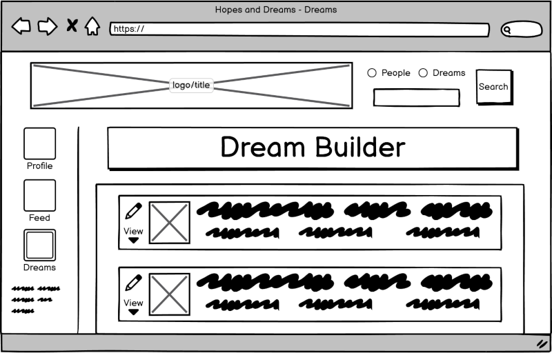

### Dream Editor Page

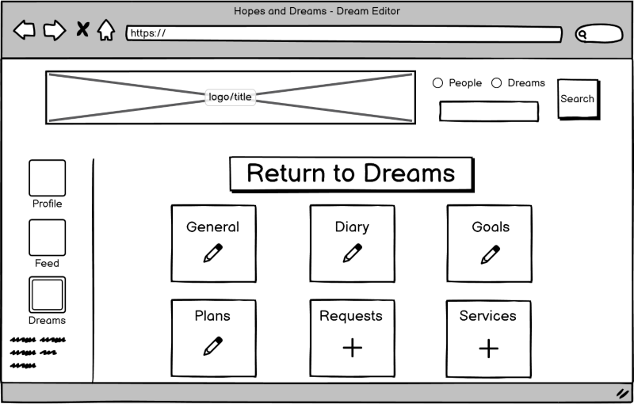

### Profile Page

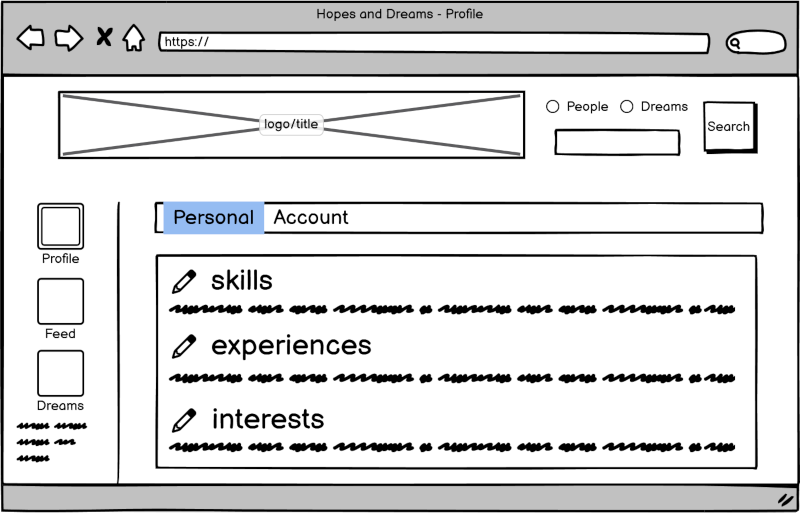

## Tablet Screen Size (768px)

### Landing Page

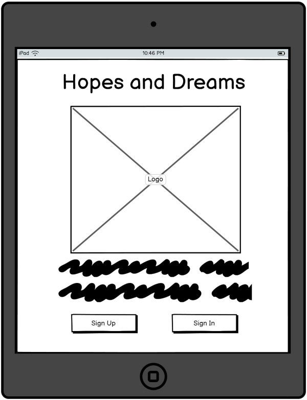

### Feed Page

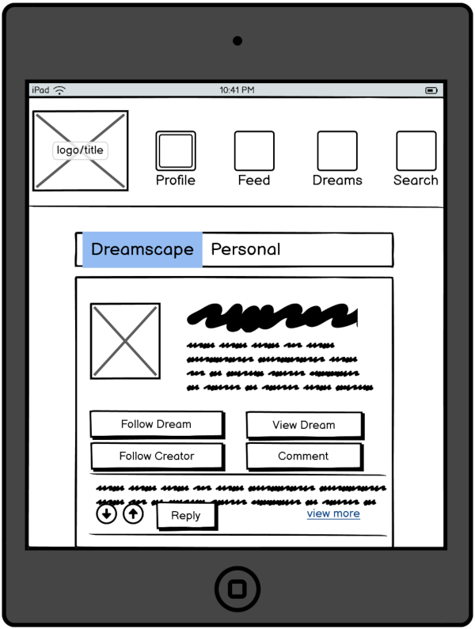

### Dreams Page

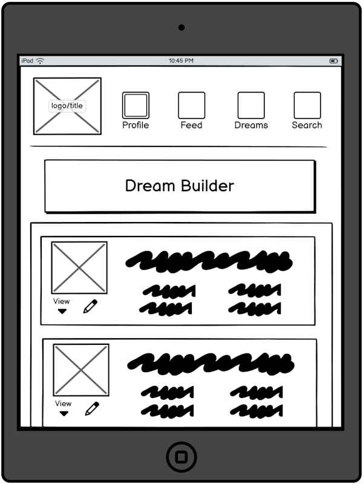

### Dream Editor Page

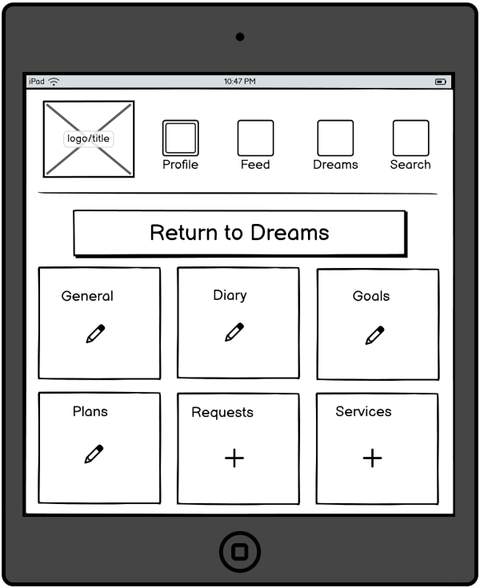

### Profile Page

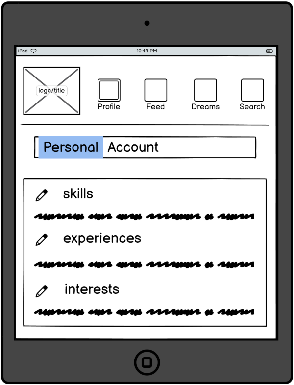

## Mobile Screen Size (320px)

### Landing Page

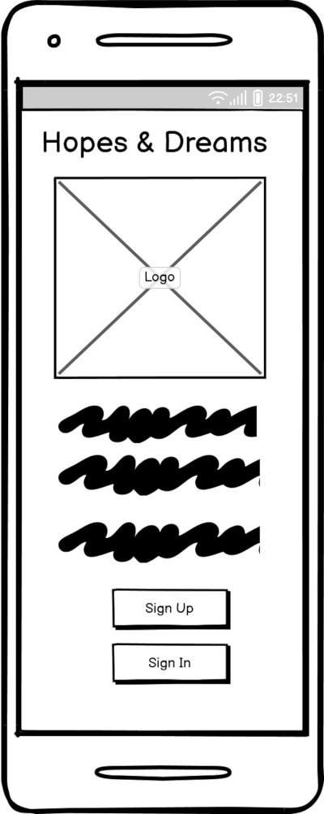

### Feed Page

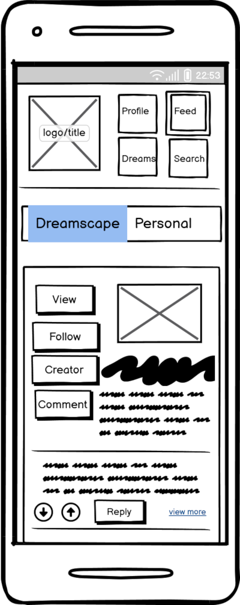

### Dreams Page

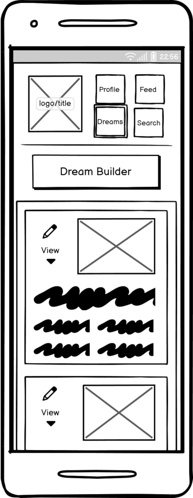

### Dream Editor Page

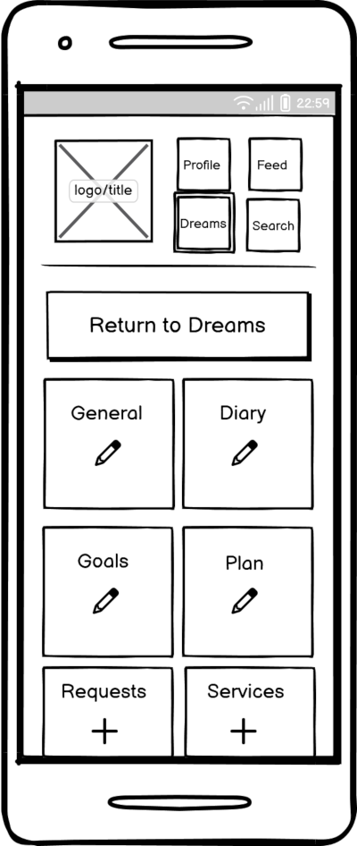

### Profile Page

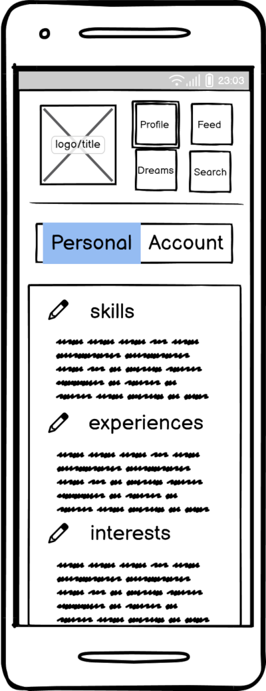